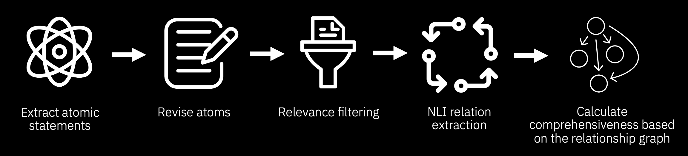

[](https://opensource.org/licenses/Apache-2.0)
[](https://www.python.org/downloads/release/python-3120/)


# Comprehensiveness Scores for Automatic LLM Factuality Evaluation

While several different methods have been proposed for automatically judging the factual precision of LLM outputs, comparatively less attention has been given to evaluating their comprehensiveness and factual recall. Existing factuality measures aiming to incorporate recall typically rely on simple and potentially unreliable heuristics, such as the expected number of supported atomic statements in a model response. Instead, the comprehensiveness scores implemented in this repository perform a fine-grained analysis of the relationships between the facts in the retrieved pieces of context and the facts in the evaluated output, identifying any relevant context items that are missing from the output.

Three main versions of comprehensiveness are provided in this repository:
1. The **NLI-based** comprehensiveness, which identifies the atomic facts and their relations using atomization and NLI relation extraction similar to the original FactReasoner.
2. The **Q&A-based** comprehensiveness, which instead mines questions covering the factual content of the considered texts, generates answers to these questions based on the evaluated model output as well as different pieces of context, and compares these answers to determine their relationships. The obtained question-answer pairs can then act as a drop-in replacement for the atomic facts used in the NLI-based strategy.
3. The **end-to-end** comprehensiveness, which uses LLMs to assess comprehensiveness directly.

Compared to the NLI-based pipeline, the Q&A comprehensiveness can leverage strong LLM capabilities in question answering and take into account wider context when answering each question. It is also more scalable, as it only needs to compare answers to matching questions instead of performing pairwise comparisons between all claims in each text.

The key stages of the NLI-based and Q&A-based comprehensiveness pipelines are illustrated in the diagrams below.

### NLI-Based Pipeline


### Q&A-Based Pipeline


## Installation Instructions
For development and running experiments, we need to create a Python 3.12 environment that contains the required dependencies. This can be done easily by cloning the `FactReasoner` git repository, creating a conda environment with Python 3.12 and installing the main `fact_reasoner` package in that environment, as follows:

```
git clone git@github.com:IBM/FactReasoner.git
cd FactReasoner
git checkout comprehensiveness
conda create -n comprehensiveness python=3.12
conda activate comprehensiveness
pip install -e .
```

Some functionality of this package relies on an external probabilistic reasoning engine. We use the open-source C++ `merlin` probabilistic inference library available [here](https://github.com/radum2275/merlin). The C++ library needs to be compiled locally and the path to the binary must be provided in the `MERLIN_PATH` environment variable. You may also need to install [boost](https://www.boost.org/) libraries as a dependency:

```
wget https://archives.boost.io/release/1.75.0/source/boost_1_75_0.tar.bz2
tar --bzip2 -xf ./boost_1_75_0.tar.bz2
cd boost_1_75_0
./bootstrap.sh
./b2
export LD_LIBRARY_PATH=<path to boost installation directory>:$LD_LIBRARY_PATH
```

There are also additional environment variables that need to be configured before running the code. For convenience, we recommend creating a `.env` file with the following variables:

```
RITS_API_KEY=<your API key for RITS>
LITELLM_LOG=WARNING
DATA_PATH=<the path to the data/ folder in this repository>
RESULTS_PATH=<the path to the results/ folder in this repository>
MERLIN_PATH=<the path to the compiled merlin library>
```

## Running Experiments
The easiest way to run comprehensiveness experiments is to use the `orchestrate.py` script, which automatically handles sweeps over multiple experiment parameters (such as the used models, comprehensiveness pipeline variants, etc.) and the corresponding job submissions on the cluster.

To use the script, please follow the steps below:
1. Install the project and activate the corresponding environment (see the instructions above for more details). Make sure the required environment variables are correctly set.
2. Run the `orchestrate.py` script with the desired experiment settings — you can run `python3 orchestrate.py --help` to see all the options. Note that you will need to specify the name of the conda/mamba environment for the project and the path to the repository root.
3. Once you start the script, it will show you the planned experiment schedule and wait for a short period of time, allowing you to inspect the output and abort the experiment submission in case of any issues. Further delay is applied before the submission of each job to avoid overwhelming the cluster with a large number of concurrent submissions.

Please see `orchestrate.sh` for an exhaustive list of `orchestrate.py` parameters that can be used to replicate the main experiments. Note that in real use, it would be advisable to split these experiments into smaller batches, as attempting to run all of them at once could result in unreasonably high resource usage.

## Direct Code Use
Instead of running the full experiments, you may wish to use the comprehensiveness metric directly on your own data. A minimal example of how to do this is provided below:

```python
from dotenv import load_dotenv

from fm_factual.atom_extractor import AtomExtractor
from fm_factual.batch_atom_reviser import BatchAtomReviser
from fm_factual.comprehensiveness import (
    ComprehensivenessPipeline,
    DatasetConfig,
    EndToEndFactGraphMiner,
    NliFactGraphMiner,
    QagFactGraphMiner,
)
from fm_factual.coverage_evaluator import CoverageEvaluator
from fm_factual.nli_extractor import NLIExtractor
from fm_factual.output_generator import OutputGenerator
from fm_factual.qag_processor import QagProcessor
from fm_factual.qag_utils import compare_quantities_with_units_definition
from fm_factual.query_context_summarizer import QueryContextSummarizer
from fm_factual.relevance_estimator import RelevanceEstimator

# Load the necessary environment variables from the .env file
load_dotenv()

# The model to use for evaluating comprehensiveness
MODEL = "gpt-oss-20b"
# If you wish to generate responses to evaluate on the fly using
# a model instead of using pre-defined responses, you can specify
# its ID in this variable. Otherwise, you can set it to None as we
# do here.
EVALUATED_MODEL = None
# The minimum threshold to consider information relevant on the scale
# from 1 (entirely unrelated) to 5 (essential)
RELEVANCE_THRESHOLD = 3.5
# The minimum confidence level to consider information to be implied
# by a given text.
CONFIDENCE_THRESHOLD = 2.0
# The comprehensiveness metric version to use.
# Can be one of "nli", "qa", "e2e" and "e2e-base" (where e2e-base
# doesn't include few-shot examples)
VERSION = "qa"

# This component summarises the contexts during the comprehensiveness
# evaluation. It is optional, but recommended.
query_context_summarizer = QueryContextSummarizer(model=MODEL)

# Instantiate the components for the desired comprehensiveness version
if VERSION == "nli":
    atom_extractor = AtomExtractor(model=MODEL, prompt_version="v2")
    atom_reviser = BatchAtomReviser(model=MODEL)
    relevance_estimator = RelevanceEstimator(model=MODEL)
    nli_extractor = NLIExtractor(model=MODEL)
    fact_graph_miner = NliFactGraphMiner(
        relevance_threshold=RELEVANCE_THRESHOLD,
        atom_extractor=atom_extractor,
        atom_reviser=atom_reviser,
        relevance_estimator=relevance_estimator,
        nli_extractor=nli_extractor,
        max_atomization_batch_workers=1,
    )
elif VERSION == "qa":
    qag_processor = QagProcessor(
        model=MODEL,
        comparison_tools=[compare_quantities_with_units_definition],
        inject_prompt_template=True,
    )
    fact_graph_miner = QagFactGraphMiner(
        relevance_threshold=RELEVANCE_THRESHOLD,
        confidence_threshold=CONFIDENCE_THRESHOLD,
        qag_processor=qag_processor,
    )
elif "e2e" in VERSION:
    if VERSION == "e2e-base":
        coverage_evaluator = CoverageEvaluator(model=MODEL, version="base")
    else:
        coverage_evaluator = CoverageEvaluator(model=MODEL, version="few-shot")
    fact_graph_miner = EndToEndFactGraphMiner(coverage_evaluator=coverage_evaluator)
else:
    raise ValueError(f"Unexpected version {VERSION}")

if EVALUATED_MODEL is not None:
    output_generator = OutputGenerator(model=MODEL)
else:
    output_generator = None

# Initialise the comprehensiveness pipeline
comprehensiveness_pipeline = ComprehensivenessPipeline(
    fact_graph_miner=fact_graph_miner,
    query_context_summarizer=query_context_summarizer,
    output_generator=output_generator,
)

# Prepare the sample data
user_query = "Is Atlantic Meridional Overturning Circulation (AMOC) expected to collapse this century due to ongoing global warming?"

context_1 = "Data-driven estimators indicate that a collapse of the AMOC could occur around mid-century under the current scenario of future emissions."

context_2 = "Across 34 climate models, the AMOC is shown to be resilient to extreme greenhouse gas and North Atlantic freshwater forcings. Upwelling in the Southern Ocean, driven by persistent Southern Ocean winds, sustains a weakened AMOC, preventing its complete collapse. A Pacific Meridional Overturning Circulation (PMOC) emerges in almost all models but is too weak to balance all of the Southern Ocean upwelling, suggesting that an AMOC collapse is unlikely this century."

evaluated_answer = "Recent scientific analyses and expert consensus indicate a high risk of a collapse of the Atlantic Meridional Overturning Circulation (AMOC) within this century due to ongoing global warming."

sample = {
    "question": user_query,
    "context_1": context_1,
    "context_2": context_2,
    "answer": evaluated_answer,
}

config: DatasetConfig = {
    "question_field": "question",
    "context_fields": (
        "context_1",
        "context_2",
    ),
    "answer_fields": ("answer",),
}

# Run the pipeline on the sample. Note that the pipeline returns a list of results
# to accommodate multiple answers, so we need to retrieve the first element.
result = comprehensiveness_pipeline.run_sample(sample, **config)[0]
```

Please see the `climate_demo.ipynb` notebook under the `notebooks/` folder for a more complex example.

## Contact
If you have any questions regarding the comprehensiveness metrics or their implementations, please contact Javier Carnerero Cano (javier.cano@ibm.com) or Adam Dejl (adam.dejl18@imperial.ac.uk).