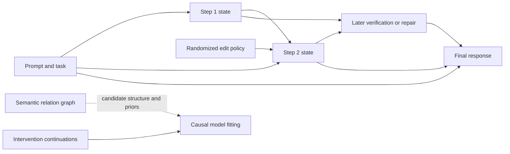

# Causal graphical analysis of chain-of-thought reasoning

**Research plan — 1 October 2026.** Repository reviewed at commit `8201253`.
This document proposes research; it does not report new experimental results.

**Objective.** Determine which steps in a reasoning model's visible chain of thought
(CoT) influence its subsequent reasoning and final response, how those influences
propagate or are repaired, and whether a probabilistic graphical model can predict
the effects of previously untested interventions more efficiently than direct
Monte Carlo evaluation.

The recommended approach is to combine the repository's logical-coherence graph
with a **separate, experimentally fitted temporal causal model**. The coherence
graph describes semantic relations and suggests candidate dependencies. Randomized
interventions establish behavioral effects. A directed model represents those
effects and supports inference over new edits, combinations of edits, and repair
policies. An undirected coherence MRF, by itself, cannot answer causal questions.

The main scientific claim to test is:

> A sparse, uncertainty-aware graphical abstraction of reasoning steps can predict
> intervention outcomes across new reasoning traces and intervention combinations,
> while distinguishing semantic support, behavioral influence, and recovery from
> errors.

Sentence-level interventions, causal graphs of reasoning, and CoT mediation are
already studied. They are baselines, not proposed first contributions. The intended
contributions are intervention-predictive graphical inference, explicit modeling of
repair and interacting reasoning paths, and efficient experiment design with
calibrated uncertainty. Their novelty remains conditional on replication and the
closest-prior-work comparison in [literature.md](literature.md).

## Reading guide

- This document: research questions, modeling choices, experimental protocol,
  evaluation, implementation plan, resources, and milestones.
- [methods.md](methods.md): estimands, causal semantics, proposed inference
  algorithms, an executable-by-hand example, and identifiability limits.
- [proofofconcept.md](proofofconcept.md): a concrete coherence-informed SCM,
  illustrated interventions and counterfactuals, and a reproducible simulator.
- [literature.md](literature.md): literature synthesis, closest-work comparison,
  references, and search provenance.
- [references.bib](references.bib): bibliography with verified arXiv metadata and
  foundational references.

## 1. Scope and the distinctions the study must preserve

We study **model-emitted, accessible reasoning traces** from an autoregressive
reasoning model. The intervention is applied to a model's own generated prefix,
then that same model continues. A requested post-hoc explanation, a provider's
reasoning summary, and an editable native reasoning stream are different objects;
results from one do not establish properties of another.

Initially use open-weight models with controllable tokenization, chat templates,
reasoning delimiters, and prefix continuation. API-only models are an extension
when their interfaces expose the required intervention surface. A fresh user
message saying “continue this reasoning” is a different experimental condition,
not an interchangeable substitute for continuing the original assistant stream.

Five quantities must remain separate:

| Quantity | Example question | Evidence required |
|---|---|---|
| Step validity | Is this arithmetic or logical statement correct? | Solver, evidence, or calibrated annotation |
| Logical coherence | Do these claims support or contradict one another? | Semantic relations and the existing LCS model |
| Behavioral causal influence | Does changing this emitted step change a later semantic event or answer distribution? | Randomized prefix interventions and continuations |
| Mechanistic mediation | Do specific hidden representations carry the influence? | Activation/cache/attention interventions with controls |
| Explanatory faithfulness | Does the text accurately communicate the reasons underlying the decision? | Multiple behavioral and mechanistic tests; no single score suffices |

A correct but redundant step can have negligible deletion effect. An incorrect
step can be highly influential. A model can notice and repair an injected error,
leaving its final answer unchanged despite a substantial effect on its reasoning.
A changed answer can reflect generic disruption rather than use of the edited
step's meaning. These are central experimental cases, not incidental caveats.

The target is initially **behavior under specified interventions on visible CoT**.
We do not claim recovery of a unique internal reasoning algorithm from transcripts.
Also distinguish causality *within the story described by a problem* from causality
*in the model's production of its answer*.

## 2. What the repository supplies

The existing coherence work gives a stronger starting point than a generic
sentence-attribution implementation. However, several interfaces need adaptation.

| Existing asset | Use in this project | Required change or limitation |
|---|---|---|
| [Coherence research plan](../../ideation/research_plan.md), [MRF deep dive](../../ideation/coherence_mrf_deepdive.tex), [MLN deep dive](../../ideation/coherence_mln_deepdive.tex) | Semantic modeling, contradiction/support factors, alternative readouts | Their “causal” discourse relations do not establish generation-time causal edges |
| [Current coherence manuscript](../../iclr2027/coherence/main.tex) | Current definitions and experimental context | Repository manuscript, not an independently verified publication |
| [Atomizer](../../../src/fact_reasoner/core/atomizer.py), [reviser](../../../src/fact_reasoner/core/reviser.py) | Claims and semantic normalization | Preserve original spans, repeated claims, plans, uncertainty, and revisions; edits act on original text |
| [RelationMiner](../../../src/fact_reasoner/lcs/relation_miner.py), [candidate pairs](../../../src/fact_reasoner/lcs/candidate_pairs.py), [taxonomy](../../../src/fact_reasoner/lcs/taxonomy.py) | Candidate semantic graph and edge-type features | Exact token offsets and nonlocal audit pairs; semantic direction need not equal temporal causal direction |
| [Strength calibration](../../../src/fact_reasoner/lcs/strength.py), [priors](../../../src/fact_reasoner/lcs/priors.py) | Calibrated semantic confidence and factuality priors | These are not causal-effect probabilities; do not use full future traces as online predictors |
| [FactGraph](../../../src/fact_reasoner/fact_graph.py), [factors](../../../src/fact_reasoner/factors.py) | Graph serialization and coherence baseline | Introduce separate causal node/edge schemas and normalized conditional mechanisms |
| [MarkovNetwork](../../../src/fact_reasoner/markov_network.py), [Merlin wrapper](../../../src/fact_reasoner/inference.py) | Discrete factor serialization, MAR/PR/MAP infrastructure | Compile a mutilated directed model to factors; never interpret ordinary MRF clamping as intervention |
| [LCSScorer](../../../src/fact_reasoner/lcs/lcs_scorer.py), [pipeline](../../../src/fact_reasoner/lcs/pipeline.py) | `mean_marginal`, `consistency`, `reified`, and `log_partition` baselines | `MLNCoherenceModel` has a pairwise core but its scoring/grounding/learning remain unimplemented |
| [LoCoBench schema](../../../src/fact_reasoner/locobench/schema.py), [perturbations](../../../src/fact_reasoner/locobench/perturb.py) | Reusable validation and controlled semantic-edit patterns | LoCoBench is not a benchmark of the model's causal computation; generate new continuations |
| [Coherence baselines](../../../src/fact_reasoner/coherence_baselines) | NLI, discourse, ROSCOE, and judge comparisons | Treat their predictions as observational baselines |

The factor container accepts factors of arbitrary scope despite pairwise-oriented
documentation. Small CPTs and auxiliary gates are therefore plausible reuse paths.
The Merlin wrapper currently serializes a `MARKOV` network and exposes marginal,
partition, and MAP-mass results. It does not supply a causal intervention API,
counterfactual coupling, or a returned MAP assignment suitable for edit search.
Those capabilities require explicit new code and validation.

## 3. Literature conclusions that determine the design

The review in [literature.md](literature.md) motivates six decisions:

1. **Replicate perturbation baselines first.** Lanham et al. (2023) establish
   truncation, mistake insertion, and paraphrase tests. Turpin et al. (2023) and
   Arcuschin et al. (2025) show why plausible explanations cannot be taken as
   complete accounts of model behavior.
2. **Use sentence-level resampling and sentence-to-sentence effects as strong
   baselines.** Bogdan et al., *Thought Anchors* (2025), already provides both,
   including masking/logit-based causal graphs. A new graph visualization alone
   would contribute little.
3. **Distinguish temporary removal from sustained absence.** Macar et al.,
   *Thought Branches* (2025), studies resampling, semantic recurrence, resilience,
   and CoT transplantation for mediation. Our extensions must improve prediction,
   joint-intervention inference, or experimental efficiency beyond those methods.
4. **Measure the trajectory as well as its endpoint.** Xiong et al. (2025) separates
   intra-draft and draft-to-answer faithfulness and distinguishes following from
   explicit correction. We extend this to probabilistic transition and dependency
   models, not a rebranding of the same categories.
5. **Do not claim that applying SCMs to CoT is new.** Bao et al. (2024), Project
   Ariadne (2026), information-flow analysis (Jia et al., 2026), and CASE (2026)
   already use structural perspectives. Noisy-OR models of answers to causal
   problems also exist, but concern a different causal object.
6. **Behavioral and internal interventions answer different questions.** Geiger et
   al. (2021), Vig et al. (2020), and recent activation-patching studies motivate a
   small mechanistic validation track. September 2026 preprints reinforce the
   importance of task difficulty, target-specific counterfactuals, and the gap
   between judged and rollout-estimated step importance. Their findings are
   reported evidence to replicate, not settled universal properties.

## 4. Research questions and falsifiable hypotheses

| ID | Question and working hypothesis | Experiment that can reject it |
|---|---|---|
| H1 | Semantic relations provide useful, imperfect priors over behavioral dependencies. | Compare semantic-prior versus flat-prior causal models on held-out intervention log loss at equal rollout budget. Reject useful-prior hypothesis if no improvement or systematic missed edges. |
| H2 | A bounded-indegree temporal model approximates intervention responses sufficiently well for selected task families. | Compare its predicted answer and later-event distributions with independent intervention rollouts, including unseen combinations. Reject sparsity/abstraction if residual dependence remains large. |
| H3 | Repair and semantic recurrence explain a meaningful subset of weak answer-level effects. | Compare answer effects with trajectory changes, repair hazards, and one-time versus sustained-edit policies. Reject if repair-aware modeling gives no held-out gain. |
| H4 | Joint-premise and alternative-path factors explain effects missed by pairwise attribution. | Run randomized two-step factorial interventions. Reject if higher-order models fail to improve prediction beyond matched-capacity pairwise models. |
| H5 | Graph-guided experiment selection reduces continuation cost without sacrificing accuracy or uncertainty coverage. | Compare learning curves against uniform sampling and importance-only allocation under equal generated-token budgets. |
| H6 | Behavioral edges sometimes align with internal information-carrying pathways, but agreement is incomplete. | Test targeted activation interchange against random-span/layer controls on held-out examples. Report disagreement rather than using one measure as universal ground truth. |

The primary endpoint is H2: **held-out interventional prediction error**. Human
ratings of graph plausibility, correlation with correctness, and aesthetically
convincing case studies are secondary evidence.

## 5. Units, observations, and graph layers

### 5.1 Preserve the original trace

Each trace stores the exact prompt, generated token IDs, model/template revision,
decoding settings, native reasoning delimiters, stop reason, reasoning spans,
answer-stage explanation, and final response. Keep token and character offsets.
Sentence segmentation is the initial unit; substeps and clauses are a granularity
ablation, not a prerequisite for the first pilot.

Each step can contain multiple claims and has a role distribution over setup,
retrieval, computation, inference, planning, verification, uncertainty,
backtracking, and answer commitment. Repeated claims remain separate occurrences.
Maintain a semantic identity linking recurrences without merging their timestamps.
Plans and uncertainty statements cannot be discarded simply because they are not
truth-evaluable factual atoms.

### 5.2 Three linked graph objects

**Semantic graph, `G_sem`.** Claims, relations, conjunctions, contradictions,
equivalence, and resolution. This layer can contain cycles and can reuse the LCS
MRF. It expresses relations among propositions, not a causal factorization of
the generator.

**Temporal causal abstraction, `G_cau`.** Step-state variables and answer outcomes,
with candidate arrows only from earlier to later occurrences. Include prompt/task
features as possible parents throughout; the answer may depend on the prompt and
any earlier step. A backward-looking statement at time `j` is a new event at `j`,
not an arrow from the future into the already generated past.

**Optional mechanistic graph, `G_mech`.** Selected token-span activations,
attention routes, or cache states aligned to semantic variables by intervention
tests. This is a validation layer for a subset, not required for API-level effects.



In the edited condition, the policy replaces the mechanism generating the edited
step. The graph is illustrative: a total effect from step 1 to step 3 does not,
by itself, identify a direct edge between them.

### 5.3 State representation and alignment

Start with a small factored state: semantic value or selected plan, validity label,
status (`asserted`, `retracted`, `unresolved`), and whether the targeted content is
present. Keep raw text as the authoritative observation. Correctness alone is too
coarse: two incorrect numeric values may induce different downstream answers.

Use exact semantic registers and program-defined landmarks on controlled tasks.
For natural tasks, define a finite set of landmarks from the original prompt and
trace before observing treatment outcomes, then detect their occurrence in every
continuation. Add `absent`, `ambiguous`, and `not reached` states. A regenerated
“step 7” is not necessarily the original step 7. Supplement landmark outcomes with
fixed token-horizon events, first answer commitment, and repair latency.

Audit annotation on a blinded sample. Report both hard labels and sensitivity to
annotation confusion matrices. A sophisticated PGM cannot recover information
destroyed by an invalid step abstraction.

## 6. Intervention protocol

### 6.1 Define the experimental unit and estimand before generation

The basic unit is `(problem, original trace, target span, intervention family)`.
Fix the unedited prefix immediately before the target, and branch from that same
prefix into randomized arms. Average over a declared distribution of problems,
traces, target locations, replacement texts, and continuation randomness.

The control includes the original step and resamples the remaining continuation.
One original realized suffix is not an adequate control distribution. Generate
multiple replacements per semantic treatment when feasible, so an effect is not
an accident of one wording.

### 6.2 Intervention families

| Family | Construction | Main interpretation/control |
|---|---|---|
| Identity replay | Reinsert the exact original tokens | Harness fidelity and continuation-distribution control |
| Meaning-preserving paraphrase | Same proposition/plan with similar length | Surface-form sensitivity; verify preservation independently |
| Plausible semantic alternative | Sample alternatives from the same model and prefix; filter on a predefined semantic property | Primary behavioral contrast with measured rejection/acceptance rate |
| Targeted corruption | Change a numeric value, operator, entity binding, premise, or plan | Signed predicted downstream effect where an oracle exists |
| Targeted repair | Replace an identified error with a correct step | Positive-control improvement test, evaluated on separate examples |
| Deletion/truncation | Remove a step or end reasoning early | Historical baseline; changes information and often compute/position |
| Format/length control | Matched filler, irrelevant same-domain text, punctuation edit | Quantify disruption; filler itself can alter computation |
| Joint intervention | Independently randomize two selected steps or semantic registers | Interaction, conjunction, redundancy, and alternative paths |
| Sustained semantic exclusion | Sequential rejection/resampling to suppress recurrence | A distinct dynamic policy, with its own cost and feasibility |

Same-model sampling is followed by selection, so the selected distribution is a
**policy-conditioned distribution**, not unconditionally “on-policy.” Record
selection criteria, candidate counts, acceptance rate, fallback rule, and token
cost. Set those rules before observing final answers. Do not retain only successful
edits or only continuations in which the error persists.

### 6.3 Replay and continuation requirements

1. Generate an original trace under the pinned model/template configuration.
2. Locate a complete step boundary without altering the prompt or assistant role.
3. Construct and validate intervention candidates without using downstream answers.
4. Replay the prompt and prefix, replace the designated span, and recompute the
   cache from the earliest changed token. A stale cache can preserve the original
   meaning and invalidate a text intervention.
5. Generate the entire downstream suffix and answer afresh. Use equal continuation
   budgets after the boundary for the primary comparison; additionally report
   total tokens and a matched-total-budget ablation for length-changing edits.
6. Store raw continuations, all outcomes, failed edits, ambiguous annotations, and
   truncation. An unfinished answer is an outcome, not silently discarded data.
7. Randomize execution order to reduce load/time confounding and prevent shared
   mutable cache state between arms.

Use independent random seeds as the default. Common random numbers can reduce
variance if the sampler supports a validated coupling, but a shared integer seed
does not establish a model-independent individual counterfactual. Temperature-zero
experiments measure deterministic sensitivity and do not replace distributional
evaluation.

### 6.4 Outcomes

Primary answer outcomes are exact task correctness, a canonical answer category,
and probability of the oracle-predicted counterfactual answer when available.
Use solver checks for arithmetic and symbolic tasks; aggregate semantically
equivalent surface answers before estimating distributions. Retain `other`,
`invalid`, and `unfinished` categories.

Later-step outcomes include the targeted value being used, propagation depth,
explicit correction, semantic recurrence, a plan change, contradiction resolution,
and appearance of specified landmarks. Record the joint distribution of trajectory
category and answer outcome. Analyze all arms as assigned; conditioning only on
post-treatment “follow” or “repair” cases changes the population and is not a
causal subgroup effect.

## 7. Proposed model and inference portfolio

Detailed definitions and algorithms are in [methods.md](methods.md).

### M0: Required direct-intervention reference

Estimate each treatment's answer and landmark distributions by repeated
continuations. Report signed changes in correctness and target-answer probability,
plus total variation and Jensen–Shannon divergence. Include KL only with documented
smoothing. These estimates establish effects without needing a correct sparse
graph, and serve as the reference for evaluating model-based predictions.

### M1: Semantic-prior temporal causal model — primary method

Fit bounded-indegree, normalized categorical or logistic conditional mechanisms
to observational and intervention trajectories. Temporal order supplies an acyclic
ordering. Semantic edge types, proximity, shared entities, and step roles inform
soft structure priors; random noncandidate pairs protect against semantic-pruning
blind spots. No edge is fixed solely because NLI predicts entailment.

A mechanism's training loss excludes rows where that mechanism was externally
replaced. Stochastic policy probabilities are known experimental inputs, not
learned as normal generator behavior. Share parameters across compatible semantic
roles and task templates; do not attempt to estimate a unique large CPT from one
trace. Use prompt-only and recent-history baselines to test whether graph structure
adds value beyond generic predictive features.

For an intervention, replace the relevant conditional factor with the intervention
kernel and infer downstream marginals. Start with exact enumeration/variable
elimination on small graphs. Reuse the factor serialization and Merlin machinery
only after agreement with the exact oracle. Forward ancestral sampling is the
default approximate method for unconditional interventional predictions.

**Candidate contribution:** calibrated predictions of unseen edits and combinations
from a learned semantic-temporal abstraction, rather than descriptive edge maps.

### M2: Repair-aware causal state model — first extension

Augment M1 with recurrence and repair states and competing events: follow the
edited value, explicitly repair it, silently recompute, switch plans, or terminate.
Fit time-indexed transition/hazard models with right-censoring at token limits.
Observational categories describe visible behavior; “silent recomputation” requires
an operational proxy and may remain ambiguous without mechanistic evidence.

Compare one-time edits with separately randomized sustained-exclusion policies.
Predict answer outcomes, repair latency, and content reappearance. Use latent
state filtering only when the observation model is validated. A repair-aware model
must outperform an equally flexible history-conditioned baseline to justify its
extra structure.

**Candidate contribution:** a joint probabilistic account of influence, recovery,
and recurrence that predicts new trajectories. Measuring recurrence or resilience
alone is already in *Thought Branches*.

### M3: Hypergraph and mediated-policy inference — second extension

Represent a multi-premise inference with an auxiliary gate or higher-order CPT,
and alternate sufficient routes with an OR-like gate. Fit these structures using
factorial interventions; reserve unseen pairs for confirmation. Pairwise semantic
edges cannot represent every conjunctive or redundant mechanism.

Use randomized mediator transplantation at predefined boundaries to compare
operational pathways. Distinguish these effects from natural direct/indirect
effects and from attention-edge interventions. Only claim a path-specific causal
effect when the intervention and required identification assumptions justify it.

**Candidate contribution:** calibrated joint-intervention predictions and
policy-specific mediation in a common factor model. Higher-order factors,
mediation, and interaction scores individually are established tools.

### M4: Graph-guided active intervention and robust inference — scaling extension

Choose new step/arm experiments using expected reduction in uncertainty about
answer effects or graph structure per generated token. Preserve random exploration,
log assignment probabilities, and use a separate fixed-allocation confirmation set.
Compare against uniform, uncertainty-only, and anchor-importance allocation.

Propagate uncertainty over graph structure, conditional mechanisms, semantic
annotations, and finite rollout counts. Where individual counterfactuals or paths
are not identified, report bounds or sensitivity analyses. Investigate credal
factor inference for a deliberately small family of discrete graphs before
claiming scalable robust guarantees.

The concrete logical-credal branch in [methods.md](methods.md#64-a-concrete-logical-credal-research-branch)
uses interval constraints from randomized experiments to bound causal queries over
candidate structural response functions. It builds on the existing SCM-to-credal
reduction and Logical Credal Networks; the research opportunity is reliable
constraint acquisition and useful bounds for CoT, rather than a new general
reduction. This branch is optional because unknown semantic mechanisms and
response-function state-space growth can make it substantially harder than M1.

**Candidate contribution:** equal-budget gains in intervention prediction and
calibration. Reusing weighted mini-bucket inference or Bayesian active learning
without a demonstrable methodological gain is engineering, not a novelty claim.

## 8. Benchmark design

### 8.1 Tier A: Controlled mechanisms and task ground truth

Construct at least four task families with depth, branching, distractors, and
redundancy varied independently:

- Arithmetic expression DAGs with named intermediate registers.
- Horn-rule or Boolean circuits with conjunction, alternative proofs, negation,
  and irrelevant premises.
- Multi-hop entity lookup with controlled intermediate bindings and known
  counterfactual targets.
- Small state-tracking/planning programs with explicit updates and optional
  verification/recovery branches.

Maintain **two different oracles**. An instrumented synthetic stochastic reasoner
with known mechanisms validates causal inference and graph recovery. An executable
task solver establishes logical dependencies and correct counterfactual answers
for tasks given to real LLMs. The latter does not establish the LLM's actual
computational graph: the model may use a shortcut or solve the task again.

Include diagnostic motifs: pure chain, fork, collider, diamond, redundant paths,
joint necessity, irrelevant but true claims, an influential wrong step, explicit
repair, and a direct prompt-to-answer route. Controlled stochastic simulations
provide exact interventional probabilities and known null edges.

### 8.2 Tier B: Natural reasoning with checkable outcomes

Use stratified subsets of GSM8K, MATH, and selected BIG-Bench Hard tasks. Start
with arithmetic and logical deduction; add multihop QA with fixed supplied
contexts after the protocol stabilizes. Standard benchmark overlap and memorization
are handled through newly generated templates, renamed entities, and held-out
compositions, without assuming any particular model's training data are known.

PRM800K provides step-quality supervision and error examples; it does not provide
causal labels. Prefer new on-model traces rather than transplanting its entire
reference solutions into another model's native reasoning stream.

Sample across estimated difficulty, original correctness, reasoning length, and
early/middle/late positions. Use an independent screening sample to estimate
difficulty. A study restricted to 25–75% solvable questions is useful for power but
has a conditional target population; report it alongside a broader sample.

### 8.3 Tier C: Connection to logical coherence

Adapt selected LoCoBench-style contradiction/resolution and joint-premise cases
into questions requiring an actual generated reasoning trace. Hold evidence fixed,
record LCS values before and after edits, and compare them with intervention effects.
The key diagnostic is the four-way table of high/low coherence and high/low
behavioral influence, with examples of coherent bypass and influential mistakes.

Avoid expanding into unrestricted retrieval during the primary study: changing
retrieved evidence introduces another intervention surface and source of variation.

### 8.4 Models and access

Initial candidates are **Qwen3-8B** in native thinking mode and
**DeepSeek-R1-Distill-Qwen-14B**, whose reports and prior CoT studies make them useful
replication targets. Use a smaller open model for harness debugging. A matched
Qwen3 non-thinking condition can study the role of external reasoning, but does not
isolate training effects. Add a second family/scale only after the first-model
protocol is validated.

Pin exact checkpoint revisions and inference software. Record hardware,
precision/quantization, attention implementation, temperature, top-p, and maximum
tokens. Use one preregistered stochastic decoding configuration for the main study
and one temperature sensitivity check. Hardware and throughput are to be measured
in the pilot; no current deployment availability is assumed.

## 9. Baselines, splits, and ablations

Required comparisons, all under explicit token/call budgets:

| Class | Baselines |
|---|---|
| Simple attribution | Position, length, token surprisal where available, random ranking, leave-one-step-out, early forced answer |
| Text/semantic | NLI consistency, all four LCS readouts, ROSCOE, a blinded LLM judge, process reward model |
| Strong causal references | Lanham-style interventions; Thought Anchors resampling and masking graphs; Thought Branches recurrence/resampling; Xiong-style intra-draft and draft-to-answer tests |
| Predictive models | Prompt-only, local-history sequence model, independent intervention regression, temporal BN without semantic priors, matched-capacity non-graph predictor |
| Mechanistic subset | Raw attention as a diagnostic baseline; random and targeted activation patching; span-matched control patches |

Split by **problem/template**, keeping all traces and continuations from one problem
together. Use 60/20/20 train/validation/test as an initial allocation, stratified by
family. Test both new problems and held-out intervention types/combinations. A
separate transfer analysis holds out a model family; do not silently pool mechanism
parameters across models.

Primary ablations: semantic prior on/off; conjunction gates on/off; repair state
on/off; bounded versus expanded history; paraphrase versus semantic change;
same-prefix alternatives versus handwritten edits; one-time versus sustained
intervention; semantic landmarks versus ordinal steps; different segmentation;
factuality priors on/off; fixed versus active allocation. Run factorial crosses
only for the hypotheses that require them.

## 10. Evaluation and statistical analysis

**Primary metrics.** Held-out answer-distribution log loss/Brier score and mean
absolute error of signed intervention effects. Compare TV/JS distances between
predicted and independently estimated intervention distributions. Report reference
Monte Carlo uncertainty; an estimate from 32 samples is not exact ground truth.

**Secondary metrics.** Prediction of downstream landmark states; target-specific
counterfactual success; interaction-effect error; repair timing/censoring; effect
ranking; coverage and width of uncertainty intervals; calibration of edge
inclusion probabilities where known graphs exist; generated tokens and wall time.
On known synthetic SCMs, add structural Hamming distance and edge precision/recall.
On real LLMs, semantic graph agreement is not causal graph ground truth.

**Uncertainty.** Bootstrap at the problem level, preserving trace/arm structure,
and use nested sampling or hierarchical models for replacement and rollout
variation. Show per-family/model results and the declared pooled estimand. Use
multiple-testing correction for exploratory edge discovery; reserve confirmatory
tests for fixed hypotheses. Distinguish uncertainty of the simulator reference,
parameter estimation, annotations, and approximate inference.

**Practical nulls.** Failure to detect an effect is not evidence of independence.
Declare “small within resolution” only using an equivalence interval, initially
±5 percentage points for correctness on prespecified pooled strata. Trace-specific
experiments with few rollouts will often remain inconclusive.

**Power planning.** For two independent Bernoulli arms with probabilities near 0.5,
the difference has standard error approximately `sqrt(0.5 / n)` when each arm has
`n` draws. Detecting a 0.10 difference with two-sided 5% significance and 80% power
requires roughly `n = 392` per arm before clustering/multiplicity adjustments.
Consequently 8–32 continuations per arm are screening data, not precise per-step
null tests. Use pilot variance estimates and simulation-based hierarchical power
analysis to allocate confirmation samples; pool only across a stated population.

**Controls against circularity.** Intervention writers, outcome evaluators, and
graph miners have distinct roles and blinded inputs. The causal model sees only
information available at prediction time. Discovery may inspect full traces for
retrospective explanations, but an online predictor cannot use a future correction
or the realized answer as an input feature. Freeze evaluation rules before the
test set. Use direct solver labels wherever possible.

## 11. Implementation and data contract

Create a new namespace rather than changing the semantics of `lcs`:

```text
src/fact_reasoner/cot_causal/             # proposed, not implemented by this plan
    schema.py                           # trace, step, edit, rollout, graph, estimand
    segment.py                          # exact offsets and semantic identities
    generation.py                       # native prefix continuation + cache checks
    interventions.py                    # policies, candidate validation, assignment
    outcomes.py                         # solver labels and blinded semantic events
    causal_model.py                     # normalized mechanisms and graph priors
    inference.py                        # surgery, exact oracle, sampling, factor export
    design.py                           # experiment allocation and logged propensities
    evaluation.py                       # clustered inference, calibration, cost
    report.py                           # linked trace/graph/intervention diagnostics
scripts/run_cot_causal.py                # resumable experiments
configs/cot_causal/                      # pinned pilot and confirmation configurations
tests/cot_causal/                        # tests introduced with implementation
```

Minimum persisted records:

| Record | Required fields |
|---|---|
| Trace | Problem/template/split IDs; model and template revision; prompt/token hashes; exact raw tokens; steps; final output; decoding and stop metadata |
| Step | Occurrence ID; character/token span; raw text; semantic identities; role and validity distributions; landmark mapping |
| Intervention | Parent trace/prefix ID; family; target span; exact replacement; policy version; candidate/acceptance counts; randomization probability; validation flags |
| Continuation | Arm/replicate IDs; sampler seed metadata; generated tokens; raw answer; canonical outcomes; repair/recurrence events; cost; failures/censoring |
| Graph/query | Semantic and causal edges separately; posterior/parameter version; estimand and intervention kernel; uncertainty method; support/coverage diagnostics |

Cache by complete experiment identity, including model/template revisions, exact
prefix, edit policy, decoding parameters, replicate ID, and annotation version.
Do not collapse repeated sampled continuations into one observation. Resume failed
jobs without overwriting prior results. Keep raw data separate from revised
annotations and model predictions.

Required correctness tests for the later implementation include: identity replay;
no suffix leakage; invalidation of changed-prefix caches; source span round trips;
intervention surgery versus conditioning on a confounded toy model; exact CPT
normalization; conjunction and redundancy motifs; absence/termination handling;
known-effect recovery; and agreement of exact versus approximate inference on
small networks. Statistical calibration tests belong on simulations, not brittle
single stochastic outputs.

## 12. Work packages, resources, and decision gates

Assume a 12-week research cycle with one primary researcher/engineer and access to
GPU inference plus a second reviewer for a blinded annotation sample. These are
planning assumptions, not assigned personnel or reserved compute.

| Weeks | Work package | Deliverable and gate |
|---|---|---|
| 1–2 | Reproduce closest methods; implement native replay and controlled SCMs | Identity/replay fidelity, causal-surgery oracle tests, and one Thought Anchors-style replication; stop causal interpretation if replay is invalid |
| 3–4 | Pilot interventions, segmentation, and annotation audit | Dataset v0, cost/power estimates, effect heterogeneity, failure taxonomy; freeze protocol before scaling |
| 5–6 | Fit M1; exact and sampled inference | Held-out single-edit predictions, semantic-prior ablation, calibrated intervals; downscope if no gain over matched baselines |
| 7–8 | M2 repair and M3 pair interventions | New-pair prediction, repair timing, replay/mediator feasibility; select one extension based on evidence |
| 9–10 | M4 budget allocation or mechanistic validation | Equal-token learning curves or targeted patching replication; keep this optional if core uncertainty remains |
| 11–12 | Locked confirmation, transfer, write-up | Reproducible artifact, model cards for intervention scope, negative results, paper draft |

### Pilot budget

Start with 60 problems, two original traces each, four selected target steps, three
arms (identity, semantic alternative, paraphrase), and eight continuations per arm:

`60 × 2 × 4 × 3 × 8 = 11,520 continuations per model`.

At an assumed average of 500 newly generated suffix tokens, that is 5.76 million
generated tokens per model, excluding original traces, rejected candidates,
annotations, and prefix prefill. The pilot is primarily a feasibility and variance
study. Long math traces can make the 500-token assumption substantially optimistic.

A larger allocation of 200 problems, two traces, six steps, four arms, and 16
continuations would require 153,600 continuations or 76.8 million generated tokens
per model at the same average length. Do not launch that full cross-product
automatically. Down-select interventions and allocate confirmation effort using
pilot estimates. Pair interventions and mediation require additional arms and
must receive separate budget lines.

Estimate cost as generated tokens plus prefill/replay and annotation costs;
measure throughput on actual sequence lengths, batch sizes, and hardware. Report
GPU-hours or billed cost from logs, not assumed tokens/second. A 14B model's feasible
precision, batch size, and sequence length depend on available accelerator memory.

### Prespecified success criteria, finalized after the pilot

1. **Harness:** exact replay under deterministic settings where supported, and
   distributional equivalence under the stochastic production sampler; failures
   traced to a documented cause before using the backend.
2. **Core model:** target at least a 10% relative reduction in held-out proper
   scoring loss against the best matched-budget non-graph baseline, with a
   problem-clustered interval excluding zero improvement. Treat this as a planning
   threshold to preregister, not a forecast.
3. **Calibration:** nominal 90% predictive/effect intervals near nominal coverage
   on known-effect simulations, with widths reported and a reference that does
   not reward vacuous intervals. Empirical LLM-effect coverage uses an independent,
   high-replication reference and incorporates its uncertainty.
4. **Interaction/repair:** meaningful gains on dedicated motifs and held-out
   natural examples; an improvement only on the training perturbations is insufficient.
5. **Efficiency:** target the same intervention-effect error with at least 30%
   fewer generated tokens than uniform allocation, including rejected candidates
   and overhead. Do not pursue active selection if overhead eliminates the gain.

If M1 fails, the deliverable becomes a rigorous intervention dataset and an
abstraction-failure analysis. If semantic priors do not help, retain them only as
descriptive annotations. If sparse models fail but history-conditioned predictors
work, characterize the required state/history before proposing a larger PGM.
If mechanistic and text-level effects disagree, report both intervention targets;
do not tune away the disagreement to support a preferred faithfulness narrative.

## 13. Risks and specific mitigations

| Risk | Mitigation and interpretation |
|---|---|
| Implausible edits trigger generic recovery | Same-prefix sampled alternatives, paraphrases, length controls, target-specific outcomes, and edit-family stratification |
| Coarse states omit important information | Semantic-value states, history ablation, held-out conditional checks, explicit abstention from unsupported graph claims |
| Semantic pruning misses influential plans or long links | Keep nonfactual steps; reserve random noncandidate audits; measure pruning recall on controlled graphs |
| Repair produces a false appearance of no influence | Joint trajectory/answer outcomes; one-time versus sustained policies; repair-aware models |
| Conditioning on edit success or recurrence biases effects | Analyze assigned policies; report acceptance/failure; evaluate sustained exclusion as a new intervention |
| Native traces and regenerated steps misalign | Exact original spans; semantic landmarks with absence states; alignment audit |
| PGM looks accurate through future-information leakage | Prefix-only inputs for prediction; problem-level splits; full-trace annotations limited to retrospective reports |
| Approximate inference errors masquerade as uncertainty | Exact small-graph oracle, inference convergence diagnostics, separate numerical and statistical intervals |
| Individual/path counterfactuals are not identified | Operational policy contrasts, mechanistic subset, explicit assumptions, bounds rather than invented point estimates |
| Sampling cost dominates | Pilot cost accounting, bounded query set, shared control draws with covariance-aware analysis, staged model expansion |

## 14. Expected research artifacts

The completed project should provide a versioned intervention dataset; a trace
schema preserving both semantic and temporal identity; direct causal-effect
estimates with controls; one validated temporal graphical model; an exact inference
oracle and scalable inference comparison; and a report linking each displayed edge
to the experiment and estimand that supports it.

The most useful paper would explain **when a semantic graph is a sufficient causal
abstraction of visible reasoning, when it fails, and what additional state makes
intervention prediction work**. A graph that merely agrees with a human reading of
the trace is not the success criterion.
