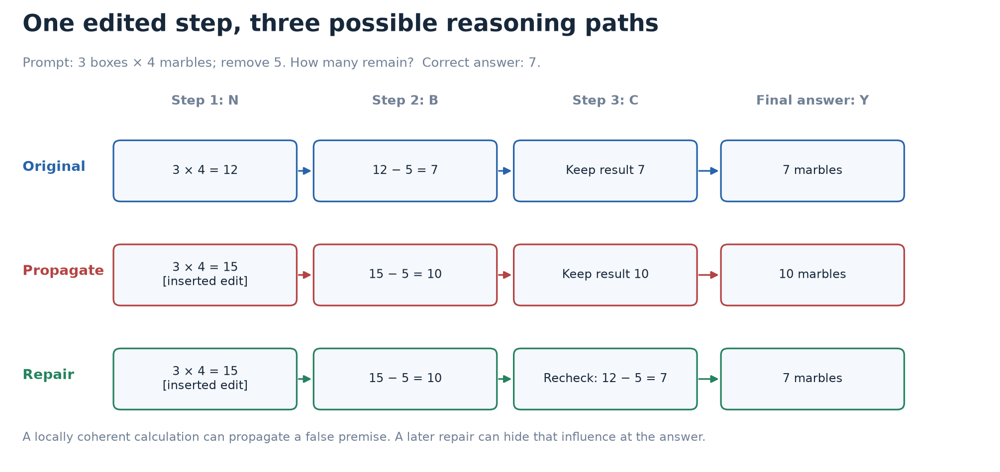
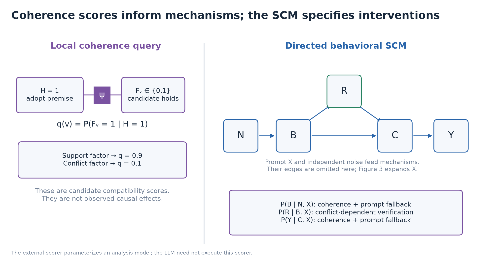
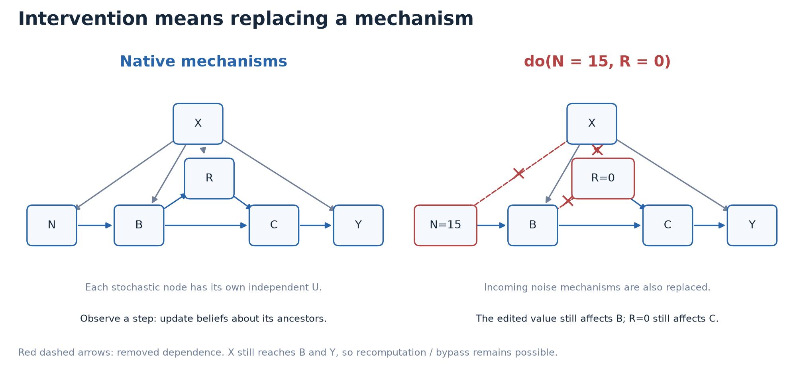
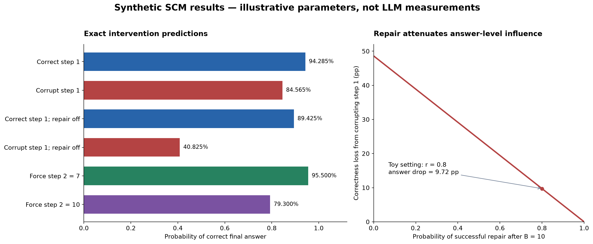
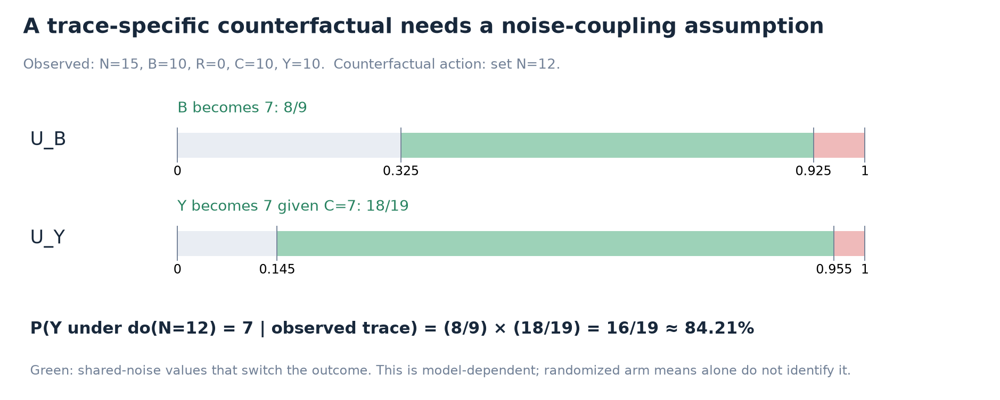
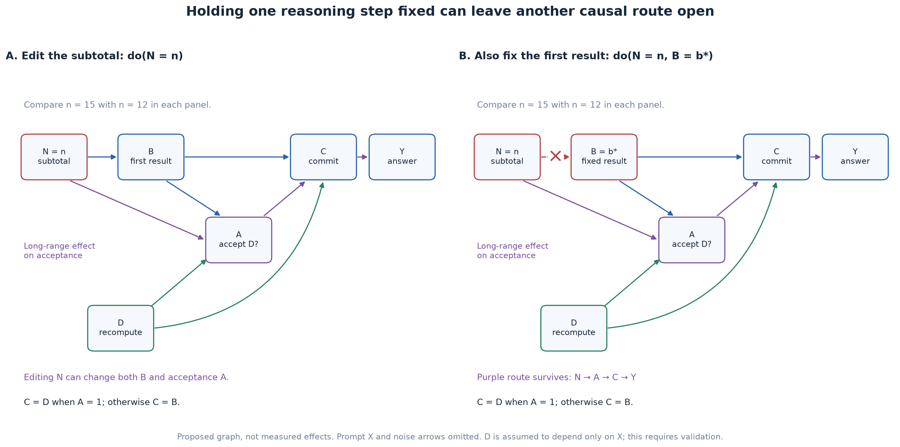

# Proof of concept: a coherence-informed SCM for chain-of-thought interventions

**Status:** concrete model proposal and reproducible synthetic example, 1 October
2026. All numerical results below follow from explicitly chosen toy parameters;
they are **not measurements of a reasoning model**. Repository interfaces were
checked at commit `8201253`.

This proof of concept accompanies the [research plan](README.md),
[methods](methods.md), and [literature review](literature.md) in
`docs/research/plan-cot/`.

## 1. The concrete proposal

Build an SCM whose variables describe **what a reasoning model writes and retains
at successive steps**. Use the existing coherence probabilistic model to evaluate
candidate next steps relative to the prefix. Incorporate those scores into
normalized, experimentally calibrated generation mechanisms. Then intervene by
replacing a mechanism, regenerate its descendants, and infer changes in later
steps and final answers.

The construction has two distinct kinds of variables:

- The coherence model's binary variables represent whether propositions hold
  under a specified premise/evidence interpretation.
- The SCM's variables represent the semantic values actually emitted or committed
  to by the model, including incorrect values and later corrections.

This distinction lets the SCM represent a model that **follows a coherent inference
from an incorrect premise**, or **repairs an incoherent intermediate result**. It
also prevents a coherence posterior from being mistaken for a causal-effect
estimate.

The proposed bridge is concrete:

> Local coherence marginals define a candidate continuation distribution;
> learned mixture weights control reliance on that distribution versus direct
> prompt-based computation; a learned conflict-dependent verification mechanism
> models repair.

The external coherence scorer is an analysis component. We do not assume the
underlying LLM literally calls it or implements this small graph internally.
Whether this is a useful causal abstraction is tested by predicting fresh
interventions.

The accompanying artifacts include seven rendered figures, exact numerical enumeration, a
trace-specific counterfactual, learning procedures, and a first experiment design.
The [reproduction script](proofofconcept.py) generates the figures and
[numerical results](figures/poc-results.json).

## 2. A small reasoning problem with propagation and repair

**Question:** “There are three boxes containing four marbles each. Five marbles
are removed. How many marbles remain?”

The correct answer is `3 × 4 − 5 = 7`.

An illustrative original CoT is:

1. “Three boxes with four marbles each give `3 × 4 = 12` marbles.”
2. “After removing five, `12 − 5 = 7` marbles remain.”
3. “The remaining count is seven.”
4. Final response: “7 marbles.”

Intervene on step 1 by inserting:

> “Three boxes with four marbles each give `3 × 4 = 15` marbles.”

The prefix before this step and the question remain the same. The edited step is
followed by a newly generated continuation. Two possible continuations are:

**Propagation:** “`15 − 5 = 10`; therefore 10 marbles remain.”

**Repair:** “`15 − 5 = 10`. Let me check the multiplication: `3 × 4 = 12`, so
`12 − 5 = 7`. Therefore 7 marbles remain.”



*Figure 1. These are constructed example paths, not sampled LLM transcripts. The
propagation path is locally consistent with the adopted subtotal but wrong relative
to the question. The repair path changes the reasoning substantially while
recovering the original final answer. [Vector version](figures/poc-trace-paths.svg).*

This example supports distinct questions:

1. Does changing the subtotal affect the next subtraction?
2. Does it increase verification or correction?
3. How much of the perturbation survives into the committed result?
4. How much survives into the final response?
5. For a particular failed trace, would correcting the subtotal have changed its
   answer under a stated counterfactual model?

## 3. Exactly what we reuse from the coherence model

### 3.1 Existing factor semantics

The repository's [factor implementation](../../../src/fact_reasoner/factors.py)
and [coherence scorer](../../../src/fact_reasoner/lcs/lcs_scorer.py) use binary
proposition variables and products of unary and relation factors:

$$
P_{\mathrm{coh}}(H,F\mid E)
=\frac{1}{Z(E)}\,\phi_H(H)\phi_F(F)\psi(H,F;E).
$$

For `use_priors=True`, an atom-to-atom entailment factor of strength `p` has
row-major values `[0.5, 0.5, 1-p, p]`; a contradiction factor has
`[0.5, 0.5, p, 1-p]`. The source prior in this case is 0.5. Equivalence has
`[p, 1-p, 1-p, p]`. These are potential tables in an MRF; their interpretation in
the whole graph is not automatically that of causal CPTs.

For a **local candidate query**, let:

- `H=1` mean “adopt the specified premise bundle for this local inference.”
- `F_v=1` mean “candidate result `v` holds in that hypothetical context.”
- `phi_F = [1-pi_v, pi_v]` express a candidate prior.

Conditioning on `H=1` gives the candidate score:

$$
q(v\mid h)
=P_{\mathrm{coh}}(F_v=1\mid H=1,h)
=\frac{\pi_v\psi(1,1)}
{(1-\pi_v)\psi(1,0)+\pi_v\psi(1,1)}.
$$

With `pi_v=0.5` and `p=0.9`, a supporting relation gives `q=0.9`; a conflicting
relation gives `q=0.1`. With a nonuniform prior these values change: for example,
`pi_v=0.8` and supporting strength `0.9` gives `q=0.72/0.74 ≈ 0.9730`.
Thus priors and relation strengths must remain separately recorded.

**This is a deliberate local semantic query.** Conditioning on acceptance of a
premise is not the claim that an asserted premise is factually true. The repository
does not currently provide a dedicated “hypothetically adopt this prefix” interface;
the PoC requires that adapter and a suitable relation prompt or solver. It reuses
the factor mathematics without silently changing the meaning of all existing LCS
truth variables.

### 3.2 Coherence under an adopted premise versus support from the question

For step 2, the premise bundle must include the adopted subtotal **and** removal
of five marbles. A subtotal alone does not entail a remaining count.

| Adopted local premise bundle | Candidate step-2 value | Relation under that bundle | Local score |
|---|---:|---|---:|
| Subtotal 12; remove 5 | 7 | Supporting | 0.9 |
| Subtotal 12; remove 5 | 10 | Conflicting | 0.1 |
| Subtotal 15; remove 5 | 7 | Conflicting | 0.1 |
| Subtotal 15; remove 5 | 10 | Supporting | 0.9 |

The third and fourth rows describe hypothetical arithmetic. Relative to the
original question, the premise “subtotal 15” is false. We therefore compute a
second, distinct score against the question's verified implication “remaining
count 7.” Call this `q_X(b)`: `q_X(7)=0.9`, `q_X(10)=0.1`.

This supplies two useful signals:

- **Local compatibility:** is the next step consistent with the values currently
  adopted in the trace?
- **Question compatibility:** is the proposed value consistent with the task's
  evidence or verified constraints?

In this arithmetic PoC the latter comes from an exact solver. In a natural-language
task it could come from the factuality/constraint layer, with its uncertainty
retained. It cannot be obtained from future generated steps when predicting a
continuation online.

### 3.3 Turning candidate scores into a generation mechanism

Independent candidate marginals need not sum to one. Normalize explicitly:

$$
Q_j(v\mid h)=\frac{q_j(v\mid h)}{\sum_{v'\in\mathcal{V}_j}q_j(v'\mid h)}.
$$

In the toy two-candidate case, `0.9 + 0.1 = 1`, so this normalization has no
numerical effect. For larger candidate sets it defines an explicit modeling
choice; it is not a theorem that normalized truth marginals equal LLM choice
probabilities. Compare it with a calibrated softmax and, where appropriate, an
exactly-one candidate encoding. Include an `other` outcome for incomplete sets.

The step-generation kernel mixes this distribution with a prompt-only pathway:

$$
P_\theta(V_j=v\mid h,X)
=\lambda_j Q_j(v\mid h)
+(1-\lambda_j)D_j(v\mid X).
$$

`D_j` describes generation from task information independent of the selected
upstream semantic value. `lambda_j` is a fitted behavioral parameter, not an NLI
confidence. A more flexible extension replaces this mixture with a regularized
multinomial model of coherence scores and prefix features (§11).



*Figure 2. Coherence supplies normalized compatibility features for selected
mechanisms. The directed graph and structural equations supply intervention
semantics. Prompt and noise edges are omitted on the right for readability.
[Vector version](figures/poc-coherence-scm.svg).*

## 4. A complete SCM: variables, parameters, mechanisms, and noise

### 4.1 What is held fixed, and what varies between runs?

An experimental run is one generated continuation of the fixed marble question.
Let $X=x_0$ denote that question, together with the fixed model checkpoint,
prompt template, and decoding configuration. We condition on $x_0$ throughout
this section. We do not estimate effects of changing the question or model.

The endogenous vector is $V=(N,B,R,C,Y)$. It records the semantic content of one
run. Parameters $\theta$ describe how a population of runs is generated. Exogenous
disturbances $U=(U_N,U_B,U_R,U_Y)$ determine the particular realized run once
$\theta$ and $x_0$ are fixed. These three objects must not be conflated:

- $B=10$ is an observed intermediate value in a particular trace.
- $p_B(15)=0.325$ is a model probability of writing 7 after subtotal 15.
- $U_B=0.50$ is a particular disturbance used by the structural equation, not
  a confidence score or an observed probability.

All numerical parameters here are specified by the example. Learning them from
LLM runs is a separate statistical problem described in §8.

Formally, for fixed $x_0,\theta$, the SCM is
$\mathcal M_{x_0,\theta}=(U,V,\mathcal F,P_U)$: $\mathcal F$ is the collection
of structural functions given in §4.6 and $P_U$ is their specified joint noise
distribution. A graph without these functions and a noise model is not yet this
fully specified SCM.

### 4.2 Endogenous variables and their observation rules

| Variable | Domain | What it records in the emitted trace |
|---|---|---|
| $N$ | $\{12,15\}$ | The subtotal explicitly asserted in step 1 |
| $B$ | $\{7,10\}$ | The remaining count first asserted in step 2 |
| $R$ | $\{0,1\}$ | Whether step 3 explicitly verifies and accepts the correct remaining value 7 |
| $C$ | $\{7,10\}$ | The remaining value committed to at the end of step 3 |
| $Y$ | $\{7,10\}$ | The canonical number returned in the final answer |

$N,B,C,Y$ are **values asserted by the model**, not binary truth variables.
For example, $N=15$ is a possible emitted value even though it is factually
incorrect. The separate outcome $\mathbf{1}\{Y=7\}$ measures answer correctness.
The coherence model's proposition variable $F_v$ from §3 is also a different
object: it expresses a belief about candidate $v$, not which candidate was emitted.

$R=1$ means an **accepted successful verification**, with evidence in the text
such as “Rechecking gives $3\times4=12$, hence 7 remain.” If $B=10$, this event
repairs an error; if $B=7$, it verifies an already correct value. Merely writing
“let me check” does not set $R=1$. $R$ and $C$ describe different properties of
the same step-3 segment: verification behavior and resulting commitment.

The toy model assumes that $R=0$ leaves the old value unchanged. A failed check
that changes the value, an unannounced recomputation, or another output such as
8 is outside this restricted model. In LLM data, record such outcomes and expand
the state space; do not discard them to force a fit. Once $R$ means successful
verification, the equation $R=1\Rightarrow C=7$ is definitional, not evidence that
every verification attempt succeeds. A richer model separates attempt, success,
and verified value.

### 4.3 The numerical quantities entering the mechanisms

The script's immutable `ToyParameters` object stores the following values.
The different parameters that equal 0.9 are separately chosen quantities.

| Symbol / script field | Default | Meaning |
|---|---:|---|
| $\rho_N$ / `rho_N` | 0.9 | Native probability of emitting subtotal 12 |
| $\pi$ / `pi` | 0.5 | Unary prior for each candidate proposition in a local coherence query |
| $s_B$ / `s_B` | 0.9 | Support/conflict factor strength used to score step-2 candidates |
| $s_X$ / `s_X` | 0.9 | Factor strength for candidate agreement with independently checked question constraints |
| $s_Y$ / `s_Y` | 0.95 | Factor strength for answer agreement with committed value $C$ |
| $\lambda_B$ / `lambda_B` | 0.75 | Weight on the coherence-derived distribution in the step-2 generation kernel |
| $\lambda_Y$ / `lambda_Y` | 0.9 | Corresponding weight in the answer-generation kernel |
| $b_B$ / `b_B` | 1 | Probability of 7 under the step-2 prompt-only kernel |
| $b_Y$ / `b_Y` | 1 | Probability of 7 under the answer-stage prompt-only kernel |
| $r_7$ / `r_7` | 0.1 | Successful-verification probability when $B=7$ |
| $r_{10}$ / `r_10` | 0.8 | Successful-verification probability when $B=10$ |

The priors and strengths are inputs to the **semantic scoring layer**. The native
subtotal probability, mixture weights, prompt-only probabilities, and verification
rates specify the **behavioral layer**. The mixture weights are not probabilities
that the LLM consciously selects a particular reasoning strategy. They parameterize
a distribution over outputs; multiple latent strategy models could realize that
same distribution.

Write $D_B(\cdot\mid x_0)$ and $D_Y(\cdot\mid x_0)$ for the prompt-only
distributions, so $b_B=D_B(7\mid x_0)$ and $b_Y=D_Y(7\mid x_0)$. This avoids
confusing a distribution with the random variable $B$. Their default point mass
at 7 is a simplifying assumption about this easy task, not an empirical assertion
that direct computation is always correct.

The intermediate deterministic quantities are:

| Quantity | Meaning |
|---|---|
| $q_j(v\mid h)$ | Coherence-model marginal that candidate $v$ holds under adopted prefix $h$ |
| $Q_j(v\mid h)$ | $q_j$ normalized over the candidate set, used as a proposed choice distribution |
| $q_X(b)$ | Compatibility of value $b$ with independently verified question constraints |
| $d(b)=1-q_X(b)$ | Conflict feature in $[0,1]$; not a calibrated probability of model error |
| $p_B(n)$ | Behavioral probability of $B=7$ under parent assignment $N=n$ |
| $r(b)$ | Behavioral probability of successful verification under $B=b$ |
| $p_Y(c)$ | Behavioral probability of answer 7 under commitment $C=c$ |

For fixed $x_0,h,\theta$, these scores and kernels are deterministic functions.
Uncertainty about their estimates would require a posterior over their parameters;
it is not represented by pretending the function value itself is a sampled $U$.

### 4.4 Derive the step-2 and answer kernels

The candidate values are $\mathcal V_B=\mathcal V_Y=\{7,10\}$. With
$\pi=0.5$ and $s_B=0.9$, the local coherence calculations of §3 give
$Q_B(7\mid12)=0.9$ and $Q_B(7\mid15)=0.1$. The other candidate receives
the complementary mass. The behavioral kernel is

$$
p_B(n)
:=P_\theta(B=7\mid N=n,x_0)
=\lambda_B Q_B(7\mid n)+(1-\lambda_B)b_B.
$$

Consequently,

$$
\begin{aligned}
p_B(12)&=0.75\cdot0.9+0.25\cdot1=0.925,\\
p_B(15)&=0.75\cdot0.1+0.25\cdot1=0.325.
\end{aligned}
$$

The value 0.325 is neither the truth probability of “15” nor an estimate of a
causal effect. It is one conditional generation probability. The causal effect
on step 2 compares that probability with 0.925 under another intervention.

Similarly, $s_Y=0.95$ yields $Q_Y(7\mid7)=0.95$ and $Q_Y(7\mid10)=0.05$.
Define

$$
p_Y(c)
:=P_\theta(Y=7\mid C=c,x_0)
=\lambda_Y Q_Y(7\mid c)+(1-\lambda_Y)b_Y.
$$

Then

$$
\begin{aligned}
p_Y(7)&=0.9\cdot0.95+0.1\cdot1=0.955,\\
p_Y(10)&=0.9\cdot0.05+0.1\cdot1=0.145.
\end{aligned}
$$

Thus an incorrect commitment does not force an incorrect answer: the specified
answer kernel still assigns probability 0.145 to 7. Conversely, a correct
commitment can be followed by an incorrect answer. These are behavioral possibilities
that a deterministic “final answer equals the last claim” model would exclude.

### 4.5 Derive the verification kernel

The question-compatibility scores are $q_X(7)=0.9$ and $q_X(10)=0.1$, giving
$d(7)=0.1$ and $d(10)=0.9$. The external scorer can compute these from the fixed
question before any step-3 text is generated; it does not inspect a future repair.

Use the logistic response function

$$
r(b):=P_\theta(R=1\mid B=b,x_0)
=\sigma\bigl(\alpha_R+\beta_R d(b)\bigr),
\qquad \sigma(z)=\frac{1}{1+\exp(-z)}.
$$

For $\operatorname{logit}(p)=\log\bigl(p/(1-p)\bigr)$, choose coefficients
to match the two illustrative verification rates:

$$
\begin{aligned}
\beta_R
&=\frac{\operatorname{logit}(r_{10})-\operatorname{logit}(r_7)}{d(10)-d(7)}
=\frac{\log36}{0.8}\approx4.479399,\\
\alpha_R
&=\operatorname{logit}(r_7)-\beta_Rd(7)
\approx-2.645164.
\end{aligned}
$$

These coefficients are **derived from specified rates**, not fitted to actual
LLM data. The positive slope expresses the hypothesis that conflicts with task
constraints elicit successful verification more often. It is not established by
the coherence model. With only two possible $B$ values, this logistic form just
reparameterizes a two-row conditional table; evidence for its generalization would
require more contexts and conflict levels. The endpoints $r=0$ and $r=1$ used in
sensitivity analysis are limiting cases, handled directly in the script.

### 4.6 Exogenous disturbances and structural equations

Specify independent disturbances with product distribution

$$
U_N,U_B,U_R,U_Y\overset{\mathrm{ind}}{\sim}\operatorname{Uniform}(0,1).
$$

Independence is an assumption of this toy SCM. These variables represent residual
run-to-run variation after the modeled parents and parameters are fixed. They are
not observed token probabilities, step-quality labels, or Bayesian parameter
uncertainty. An abstract $U_j$ also need not correspond one-to-one to an actual
LLM sampler seed.

Define the native mechanisms separately:

$$
N=f_N(U_N)=
\begin{cases}
12,&U_N<\rho_N,\\
15,&U_N\geq\rho_N.
\end{cases}
$$

$$
B=f_B(N,U_B)=
\begin{cases}
7,&U_B<p_B(N),\\
10,&U_B\geq p_B(N).
\end{cases}
$$

$$
R=f_R(B,U_R)=\mathbf{1}\{U_R<r(B)\}.
$$

$$
C=f_C(B,R)=
\begin{cases}
7,&R=1,\\
B,&R=0.
\end{cases}
$$

$$
Y=f_Y(C,U_Y)=
\begin{cases}
7,&U_Y<p_Y(C),\\
10,&U_Y\geq p_Y(C).
\end{cases}
$$

Here $\mathbf{1}\{A\}$ equals 1 when event $A$ occurs and 0 otherwise.
$C$ has no separate disturbance because its value is deterministic given $B,R$.
For example, uniform noise gives $P(U_B<0.325)=0.325$, recovering the conditional
generation probability. Equality at a threshold has probability zero and is
assigned to the second case for reproducible implementation.

The equations induce arrows $N\to B$, $B\to R$, $B\to C$, $R\to C$, and
$C\to Y$. They also assert omitted dependencies: after $B$ is set, $N$ has no
additional input to the verification mechanism; after $C$ is set, earlier text
has no additional input to the answer mechanism. Those assumptions can fail for
an LLM and must be tested. The visible DAG alone does not show the independent
noise inputs or fixed question inputs.

### 4.7 The complete probability tables

The CPTs implied by those equations are:

| Mechanism and parent assignment | Probability of first state | Probability of second state |
|---|---:|---:|
| $N$: states $(12,15)$ | 0.9 | 0.1 |
| $B$ given $N=12$: states $(7,10)$ | 0.925 | 0.075 |
| $B$ given $N=15$: states $(7,10)$ | 0.325 | 0.675 |
| $R$ given $B=7$: states $(0,1)$ | 0.9 | 0.1 |
| $R$ given $B=10$: states $(0,1)$ | 0.2 | 0.8 |
| $C$ given $(B,R)=(7,0)$: states $(7,10)$ | 1 | 0 |
| $C$ given $(B,R)=(7,1)$: states $(7,10)$ | 1 | 0 |
| $C$ given $(B,R)=(10,0)$: states $(7,10)$ | 0 | 1 |
| $C$ given $(B,R)=(10,1)$: states $(7,10)$ | 1 | 0 |
| $Y$ given $C=7$: states $(7,10)$ | 0.955 | 0.045 |
| $Y$ given $C=10$: states $(7,10)$ | 0.145 | 0.855 |

Rows sum to one. Hard zeros in the commitment mechanism encode the stated
definition of $C$; they are not soft coherence constraints.

### 4.8 One run, repeated runs, and the uncertainty being quantified

For the particular noise vector $(0.95,0.50,0.90,0.50)$, the native equations give

$$
(N,B,R,C,Y)=(15,10,0,10,10).
$$

For the **same** vector, replacing only $f_N$ with $N:=12$ gives

$$
(N,B,R,C,Y)_{N\leftarrow12}=(12,7,0,7,7).
$$

The actual noise vector is ordinarily unknown. Interventional probabilities
average over fresh $U$ drawn from its specified distribution. A trace-specific
counterfactual first conditions that distribution on the observed trace, then
reuses its possible $U$ values across worlds (§9). In general, conditioning on
partial observations can induce dependence among disturbances that were initially
independent.

A posterior $P(\theta\mid\mathcal D)$ represents a different uncertainty:
limited knowledge of mechanism parameters from a finite dataset $\mathcal D$.
A posterior predictive intervention query would average over both:

$$
P(Y=7\mid\operatorname{do}(N=n),\mathcal D)
=\int P_\theta(Y=7\mid\operatorname{do}(N=n))
\,P(\theta\mid\mathcal D)\,d\theta.
$$

The present numerical results hold $\theta$ fixed and integrate over $U$ exactly;
they do not include fitted-parameter confidence or credible intervals. Specifying
the uniform-threshold equations also chooses a cross-world noise coupling. CPTs
alone determine the single-world distributions here, but do not uniquely determine
that coupling or the trace-specific counterfactual in §9.


## 5. What an intervention means

### 5.1 Editing step 1

`do(N=15)` replaces the equation for `N` by `N := 15`. Remove its native input
dependence, including `U_N`, while preserving outgoing effects on `B`. Subsequent
variables are generated by their ordinary equations.

The experimental analogue is to replace the original step's exact text span,
recompute the cache from the changed boundary, and let the same model generate
the complete suffix and answer. The local coherence queries are then recomputed
for the edited prefix. A fixed semantic relation between “subtotal” and “remaining
count” is instantiated with the new value; one cannot retain a relation table
for the old literal sentence without checking the mapping.

Changing `N` does **not** mean setting the coherence truth variable for the
proposition “3 × 4 = 12” to false and asking the old MRF for marginals.

### 5.2 Editing step 2 or blocking repair

`do(B=10)` replaces the subtraction mechanism and leaves the previous subtotal
distribution unchanged. `do(C=10)` forces the post-verification committed value,
so the answer mechanism receives 10 even if the earlier verification succeeded.

`do(R=0)` is a valid operation in the synthetic SCM: disable successful
verification and let the committed value inherit `B`. It is **not automatically
implementable** by telling an LLM “do not check.” Such a textual instruction is a
different intervention whose compliance and side effects must be measured.

In real experiments, use verified text edits at the commitment boundary for
`C`, and study a defined no-verification policy as its own treatment. Treat the
ideal `do(R=0)` result as a simulator prediction unless a manipulation of that
mechanism is validated. Do not select only ordinary rollouts where repair happened
not to occur: that conditions on an outcome of the upstream treatment.



*Figure 3. Red crossed arrows are cut by the joint intervention. Other arrows
remain, including direct access to the question. The figure omits the individual
noise nodes; their effects on intervened variables are also replaced.
[Vector version](figures/poc-surgery.svg).*

### 5.3 Why observing a bad step is different

In the native toy model, `P(N=12)=0.9`. However:

$$
P(N=12\mid B=10)
=\frac{0.9(0.075)}{0.9(0.075)+0.1(0.675)}=0.5.
$$

Observing an incorrect remaining count updates our beliefs about the earlier subtotal.
By contrast:

$$
P(N=12\mid \operatorname{do}(B=10))=0.9.
$$

Forcing a later step cannot retroactively change how the earlier subtotal was
generated. Ordinary MRF conditioning can update ancestor beliefs; that is exactly
why it cannot stand in for causal surgery.

### 5.4 Which kinds of inference does this model support?

There are three levels of claim: an exact calculation **inside the stipulated
SCM**; an effect **identified by a real randomized text intervention**; and a
prediction **transferred from the fitted abstraction to an untested intervention**.
The first is established by the simulator. The other two need experiments and
an adequate mapping from edited text to semantic variables.

| Query class | Toy example | What it establishes, and what it needs |
|---|---|---|
| Observational prediction/diagnosis | Infer the earlier subtotal after observing remaining count 10 (§5.3) | Updates beliefs under the native joint distribution; not an intervention effect |
| Total effect on a later step | Compare the distribution of $B,R,$ or $C$ after forcing $N=12$ versus $N=15$ (§6.2) | Includes every downstream path left active; estimable from randomized text edits if outcomes are observable |
| Total answer effect | Compare answer correctness under those two subtotal interventions (§6.2) | The net effect of propagation, repair, and bypass, not a complete measure of trace influence |
| Controlled direct effect | Change $N$ while fixing $B$ to the same value (§6.5) | Tests influence outside the controlled mediator; requires a well-defined joint manipulation |
| Joint intervention / interaction | Corrupt $N$ and disable $R$ (§6.5) | Quantifies how two manipulations combine; ideal repair disabling is currently a simulator intervention |
| Stochastic intervention | Replace subtotal generation with a 25% corruption policy (§6.6) | Evaluates a specified replacement distribution, including its randomization |
| Trace-specific counterfactual | Given a failed trace, ask what correcting its subtotal would have done (§9) | Requires structural response functions and a cross-world coupling beyond observed arm probabilities |
| Partial identification | Bound the fraction harmed without selecting a coupling (§10) | Reports what the specified marginals or constraints determine, rather than an unsupported point estimate |

The toy model has no activation variables, so it cannot locate a neural circuit
or determine whether a textual step is a complete explanation of internal
computation. Nor do large answer effects prove correctness or faithfulness. Natural
direct/indirect effects or individual responsibility are not identified from two
randomized arm means alone. A fully specified SCM permits additional cross-world
calculations, but their empirical interpretation inherits its assumptions.

## 6. Compute the intervention effects by hand

### 6.1 Correct step 1

Under `do(N=12)`, step 2 is correct with probability `0.925`. If it is wrong,
verification repairs it with probability `0.8`:

$$
P(C=7\mid \operatorname{do}(N=12))=0.925+0.075(0.8)=0.985.
$$

Then:

$$
P(Y=7\mid \operatorname{do}(N=12))
=0.985(0.955)+0.015(0.145)=0.94285.
$$

### 6.2 Corrupted step 1

Under `do(N=15)`, prompt-based recomputation and imperfect trace following still
allow a correct step 2 with probability `0.325`:

$$
P(C=7\mid \operatorname{do}(N=15))=0.325+0.675(0.8)=0.865;
$$

$$
P(Y=7\mid \operatorname{do}(N=15))
=0.865(0.955)+0.135(0.145)=0.84565.
$$

Define a signed effect as corrupted minus correct step-1 assignment. The resulting
downstream effects are:

| Outcome | Correct step 1 | Corrupted step 1 | Signed change |
|---|---:|---:|---:|
| `P(B=7)` | 0.925 | 0.325 | −0.600: **−60 percentage points** |
| `P(R=1)` | 0.1525 | 0.5725 | +0.420: more successful verification |
| `P(C=7)` | 0.985 | 0.865 | −0.120 |
| `P(Y=7)` | 0.94285 | 0.84565 | −0.09720: **−9.72 percentage points** |

The error has a large effect on the next calculation. Repair attenuates its
effect before answer generation. An analysis based only on answer changes would
miss most of the trajectory-level influence.

### 6.3 Turn off successful verification in the simulator

Under `do(R=0)`, `C=B`, so:

$$
P(Y=7\mid \operatorname{do}(N=12,R=0))
=0.925(0.955)+0.075(0.145)=0.89425;
$$

$$
P(Y=7\mid \operatorname{do}(N=15,R=0))
=0.325(0.955)+0.675(0.145)=0.40825.
$$

The same step-1 corruption now costs **48.6 percentage points**. Its answer-level
effect was smaller with verification because the graph contained an effective
recovery pathway, not because the subtotal was irrelevant.

For a variable repair probability `r=P(R=1|B=10)`, with other parameters fixed:

$$
\Delta_Y(r)
=(0.325-0.925)(1-r)(0.955-0.145)
=-0.486(1-r).
$$

This expression explains the sensitivity plot below. The 80% attenuation at
`r=0.8` is a property of this specified model and this controlled comparison. It
is not a generally identified “percentage of the natural effect mediated by
repair” in real LLM traces.



*Figure 4. Exact synthetic probabilities; there are no sampling error bars because
all states are enumerated. In an LLM experiment these would be estimates with
uncertainty. [Vector version](figures/poc-intervention-results.svg).*

### 6.4 Other queries the same model answers

| Query | `P(Y=7)` | Interpretation |
|---|---:|---|
| No intervention | 0.93313 | Average over the native subtotal mechanism |
| `do(N=12)` | 0.94285 | Correct subtotal control, with suffix resampled |
| `do(N=15)` | 0.84565 | Corrupted subtotal, ordinary verification |
| `do(B=7)` | 0.95500 | Correct intermediate remaining count |
| `do(B=10)` | 0.79300 | Wrong intermediate count, followed by possible repair |
| `do(N=15,R=1)` | 0.95500 | Corrupt subtotal, but force a successful verification |
| `do(N=15,C=10)` | 0.14500 | Corrupt subtotal and force the final commitment to 10 |

In particular, changing a **late commitment** has a different effect from changing
an early value. The late edit can bypass the earlier repair mechanism. This gives
a concrete reason to distinguish intra-draft from draft-to-answer effects.

### 6.5 Controlled effects and interactions are different queries

Hold the mediator $B$ fixed at a value $b$ and compare the two subtotal assignments:

$$
\begin{aligned}
\operatorname{CDE}_{B=b}
={}&P(Y=7\mid\operatorname{do}(N=15,B=b))\\
&-P(Y=7\mid\operatorname{do}(N=12,B=b)).
\end{aligned}
$$

The result is zero for both $b=7$ and $b=10$. In this graph, every path from $N$
to $Y$ passes through $B$; the mechanism for $B$ has been replaced by the same
constant in both arms. This is a controlled direct-effect result **relative to
the selected mediator and stipulated graph**, not a claim that real LLM answers
have no direct dependence on earlier text.

Now let $A=1$ mean corrupt $N$, and $K=1$ mean disable $R$. Let $\mu_{ak}$ be
answer correctness when these two interventions have assignments $a,k$, with
$K=0$ leaving the native verification mechanism active. The interaction is

$$
\begin{aligned}
I_{AK}
&=\mu_{11}-\mu_{10}-\mu_{01}+\mu_{00}\\
&=0.40825-0.84565-0.89425+0.94285\\
&=-0.3888.
\end{aligned}
$$

Disabling verification makes corruption 38.88 percentage points more damaging.
This factorial contrast compares four **single-world intervention distributions**.
It is not a natural indirect effect through $R$, and it should not be estimated
by restricting ordinary rollouts to those with observed $R=0$.

### 6.6 A stochastic replacement policy

Replace the native subtotal mechanism with a parent-independent policy $g_\eta$
that inserts 15 with probability $\eta$ and 12 otherwise. The total probability
law gives

$$
P(Y=7\mid\operatorname{do}(g_\eta))
=(1-\eta)\,0.94285+\eta\,0.84565.
$$

For $\eta=0.25$, correctness is 0.91855. This policy replaces $\rho_N$; it does
not multiply or update the native subtotal factor. The script accepts explicit
replacement kernels, for example `do={"N": {12: 0.75, 15: 0.25}}`. For longer
traces, policies may depend on available history; that is a separate extension
from the parent-independent stochastic kernels implemented for this toy.

## 7. Proposed method A: exact causal inference with coherence-derived kernels

The native joint distribution is:

$$
P(n,b,r,c,y\mid x_0)
=P(n\mid x_0)P(b\mid n,x_0)P(r\mid b,x_0)
\mathbf{1}\{c=f_C(b,r)\}P(y\mid c,x_0).
$$

For an intervention set `I`, replace the factor for each intervened variable by
its assignment indicator or stochastic intervention kernel. For example:

$$
P^{\operatorname{do}(N=15)}(n,b,r,c,y\mid x_0)
=\mathbf{1}\{n=15\}P(b\mid n,x_0)P(r\mid b,x_0)
\mathbf{1}\{c=f_C(b,r)\}P(y\mid c,x_0).
$$

Sum out all variables except the desired outcome. There are only `2^5=32`
endogenous configurations in this example. The reproduction script enumerates
them, checks normalization for each intervention, and recovers all values above.

For a larger model, use variable elimination or ancestral simulation. A normalized
directed model can also be exported as factors through
[MarkovNetwork](../../../src/fact_reasoner/markov_network.py) and solved with the
[Merlin wrapper](../../../src/fact_reasoner/inference.py). Its causal interpretation
comes from the structural construction and factor replacement, not from the UAI
`MARKOV` header.

Do not add the old coherence factors to the joint **again** after they have been
used to form these CPTs. That would change the distribution, potentially double
count evidence, and invalidate the intended mechanisms. Similarly, do not apply
the repository's soft-probability clamping to deterministic SCM gates or do-point
masses: hard zero/one entries are intentional here. Validate hard constraints
with exact enumeration before using an approximate backend.

**What could be new:** a validated procedure for obtaining these mechanisms from
coherence queries and limited randomized rollouts, with better held-out intervention
prediction than a graph-free model. Standard factor elimination is not itself
a new inference contribution.

## 8. Proposed method B: learn the behavioral layer from randomized edits

### 8.1 Parameters to learn separately

For the minimal model, learn:

$$
\theta=(\rho_N,\lambda_B,\alpha_R,\beta_R,\lambda_Y,
\text{parameters of prompt-only kernels}).
$$

Coherence relation strengths and candidate priors have a separate calibration
dataset/objective. The source-proposition truth confidence, relation confidence,
conditional compatibility score, and causal effect are four different quantities.

Hold the initial coherence scores fixed when fitting the first behavioral model.
If both score strength and trace-following weight are free, they can trade off:
in this binary symmetric example the step-1 effect on `B` depends on
`lambda_B(2p-1)`. Without additional information, one cannot separately infer
`lambda_B` and `p` from that contrast alone.

### 8.2 A small numerical estimation example

Suppose **illustrative counts** from randomized branches were:

- Correct step 1: `B=7` in 37 of 40 continuations.
- Corrupt step 1: `B=7` in 13 of 40 continuations.

Their proportions are `0.925` and `0.325`. With compatibility scores fixed at
`0.9` and `0.1`, the difference estimates:

$$
\widehat\lambda_B
=\frac{0.925-0.325}{0.9-0.1}=0.75.
$$

The intercept is compatible with the toy prompt-only kernel returning 7. With
that assumption relaxed, estimate both levels and compare against prompt-only
experiments. These 40-per-arm counts only illustrate estimation; they are not
real data and do not yield narrow enough intervals for precise per-trace claims.

Likewise, interventions forcing `B=7` and `B=10` identify the corresponding
successful-verification rates, and commitment interventions calibrate the answer
mechanism. Use regularization or Bayesian priors instead of unbounded estimates
from sparse cells. Fitted parameters need not match the toy values.

### 8.3 Intervention-aware likelihood

For rollout `k`, let `I_k` list the mechanisms actually replaced by its experimental
protocol. The likelihood for native mechanisms is:

$$
\mathcal{L}(\theta)
=\sum_k\sum_{j\notin I_k}
\log P_{\theta,j}(v_{kj}\mid v_{k,Pa(j)},X_k).
$$

Exclude an externally inserted step from the likelihood of the native mechanism
that would have generated it. Retain all other generated descendants. Known
stochastic edit kernels contribute known assignment terms, not evidence that the
native model naturally emits the inserted value.

### 8.4 Model checks that can falsify this SCM

The toy graph assumes, for example, that `R` depends on `B` and the question but
not on `N` after `B` is fixed. Test that with crossed interventions on `N` and `B`.
A model might notice `3 × 4 = 15` even when a later subtraction has already
returned 7, violating our simplified repair equation.

Similarly, fixing `C` while varying earlier content tests whether the answer
really depends only on `C` and the question. Surface paraphrases of the same
numeric assignment test whether the semantic state is sufficiently informative.
If these checks fail, add direct dependencies or richer states; do not interpret
an attractive sparse graph as established by the initial fit.

Prefer held-out joint interventions to in-sample likelihood as the principal
assessment. Report predictive log loss, effect error, and interval calibration
against fresh rollouts at matched sampling budgets.

## 9. Proposed method C: abduction–action–prediction for a failed trace

Suppose the full observed trace corresponds to:

$$
e=\{N=15,B=10,R=0,C=10,Y=10\}.
$$

Ask: **For the same exogenous realization in this SCM, would setting the subtotal
to 12 have produced answer 7?** This differs from the population query
`P(Y=7|do(N=12))=0.94285`.

### 9.1 Abduction: update the exogenous distribution

The observed trace implies:

$$
U_N\geq0.9,\qquad U_B\geq0.325,\qquad
U_R\geq0.8,\qquad U_Y\geq0.145.
$$

Under the independent-uniform model, the conditional distributions remain
uniform on these intervals. The trace's probability is
`0.1 × 0.675 × 0.2 × 0.855 = 0.0115425`.

### 9.2 Action: replace the subtotal equation

Set `N := 12`. Retain the abducted disturbances in the other mechanisms.
Step 2 now becomes 7 if `U_B < 0.925`, giving:

$$
P(B_{N\leftarrow12}=7\mid e)
=\frac{0.925-0.325}{1-0.325}=\frac{8}{9}.
$$

The abducted `U_R ≥ 0.8` never triggers verification under either threshold, so
the counterfactual commitment equals the counterfactual step-2 value.

### 9.3 Prediction: evaluate the answer with the same disturbance

If `C` becomes 7, the answer switches to 7 when `U_Y < 0.955`:

$$
P(Y_{C\leftarrow7}=7\mid e)
=\frac{0.955-0.145}{1-0.145}=\frac{18}{19}.
$$

If `C` remains 10, the abducted `U_Y ≥ 0.145` retains the wrong answer. Therefore:

$$
P(Y_{N\leftarrow12}=7\mid e)
=\frac{8}{9}\cdot\frac{18}{19}
=\frac{16}{19}\approx0.842105.
$$



*Figure 5. Green intervals produce a switch under the counterfactual thresholds.
The calculation depends on the assumed uniform-threshold structural equations;
it is not identified by arm-level answer rates alone.
[Vector version](figures/poc-counterfactual.svg).*

The script verifies this result by enumerating 54 exogenous interval cells and
running the factual and counterfactual structural equations on each cell. This
is a small exact twin-world computation.

**Scope of the claim.** A different coupling of response functions can preserve
every listed observational and single-world interventional CPT while changing
this individual counterfactual. A common random seed in an LLM sampler is one
operational coupling, not proof that the uniform-threshold abstraction captures
the natural individual counterfactual. Use this method for explicit SCM-based
diagnostics and compare alternative couplings or bounds.

## 10. Proposed method D: robust bounds when the coupling is unknown

Let `Y^0` and `Y^1` be correctness under correct and corrupted step-1 assignment.
Here their marginals are `p_0=0.94285`, `p_1=0.84565`. Without fixing their joint
counterfactual coupling, the probability of harm satisfies the Fréchet bounds:

$$
\max(0,p_0-p_1)
\leq P(Y^0=1,Y^1=0)
\leq\min(p_0,1-p_1).
$$

Thus:

$$
0.09720\leq P(Y^0=1,Y^1=0)\leq0.15435.
$$

The average correctness loss does not alone determine how many instances are
harmed: some could be helped while others are harmed. These marginal bounds
concern the population under the two policies; they are not a bound specifically
conditioned on the failed trace in §9.

For stronger bounds, represent small mechanisms with deterministic response types
and an unknown exogenous distribution `q(u)`. Experimental probabilities impose
constraints such as:

$$
\ell_{ak}\leq\sum_u q(u)\mathbf{1}\{F_a(u)\in E_k\}\leq b_{ak},
\quad q(u)\geq0,\quad\sum_u q(u)=1.
$$

Optimize the counterfactual query over this feasible set. Coherence constraints
can restrict allowed semantic response functions **only when justified as hard
constraints**; uncertain semantic judgments belong in calibrated interval or
soft constraints. Do not eliminate incoherent behavior that the LLM actually
exhibits merely because the model is intended to reason coherently.

This follows the SCM-to-credal approach of Zaffalon et al. and connects to Logical
Credal Networks. The project-specific research problem is constructing compatible
constraints from CoT interventions and obtaining useful, calibrated bounds at
manageable cost. An unrestricted joint exogenous distribution supports linear
optimization for fixed mechanisms; imposing independent exogenous components
changes the feasible set and may require nonlinear optimization.

## 11. An SCM for long chains of thought

### 11.1 Variables and structural equations

Fix a problem $X=x$, a model/decoding configuration, a token budget, and a maximum
of $T$ reasoning steps. Let $V_t\in\mathcal{V}_t$ describe the semantic content emitted
at step $t$: for example, a subtotal, a proposed conclusion, a verification result,
or acceptance of that result. These are **emitted states, not their truth labels**.
Use finite, ordered state spaces with explicit `other`, `absent`, and `STOP`
outcomes; after termination, subsequent steps are deterministically `STOP`.
Let $Y\in\mathcal{Y}$ be the final answer, including an `unfinished` outcome.
For cost queries, also retain each segment's token count in $V_t$ and let $L$
be their sum, the number of generated reasoning tokens.

Choose parents $\operatorname{Pa}(t)\subseteq\{1,\ldots,t-1\}$ and
$\operatorname{Pa}(Y)\subseteq\{1,\ldots,T\}$. Parents may be distant steps,
so the graph need not be a first-order chain. Write $h_t=(x,V_{\operatorname{Pa}(t)})$.
For conditional kernels $k_{\theta,t}$, define the SCM explicitly by

$$
\begin{aligned}
U_1,\ldots,U_T,U_Y&\overset{\mathrm{iid}}{\sim}\operatorname{Uniform}(0,1),\\
V_t&=F_{\theta,t}^{-1}(U_t\mid h_t),\qquad t=1,\ldots,T,\\
Y&=F_{\theta,Y}^{-1}(U_Y\mid x,V_{\operatorname{Pa}(Y)}).
\end{aligned}
$$

Here $F^{-1}(u\mid h)$ selects the first state whose cumulative kernel mass
reaches $u$, using the declared ordering. Thus the kernels, ordering, and noise
law specify structural functions, not just an observational joint distribution.
The parameters $\theta$ are fixed within an SCM; uncertainty about them is handled
separately during estimation.

**Assumptions.** The selected states and parents capture all relevant prefix
information; noises are independent conditional on the fixed problem; and
unedited mechanisms remain invariant under the tested interventions. These are
hypotheses to validate on LLM continuations. Omitted strategy, wording, or execution
state can invalidate them. Enrich the state or add shared latent variables when
necessary. A later correction is a new node, never a backward causal arrow.

### 11.2 Coherence-informed mechanisms

For each candidate state $v$, use the repository's probabilistic coherence model
to query the proposition $F_v$ that its claim holds:

$$
\begin{aligned}
q_t(v;h)&=P_{\mathrm{coh},t}(F_v=1\mid E_t(h)),\\
Q_t(v\mid h)&=\frac{q_t(v;h)+\varepsilon}
{\sum_{v'\in\mathcal{V}_t}[q_t(v';h)+\varepsilon]},\qquad \varepsilon>0,\\
k_{\theta,t}(v\mid h)&=\lambda_t Q_t(v\mid h)
 +(1-\lambda_t)b_{\eta,t}(v\mid h),\qquad 0\leq\lambda_t\leq1.
\end{aligned}
$$

$E_t(h)$ is a declared evidence/adopted-premise construction using only available
parents and the prompt. $b_{\eta,t}$ is a normalized behavioral baseline, fitted
from continuations; $\lambda_t$ measures reliance on coherence in this analysis
model. Assign documented scores to non-claim states such as `other`; terminal
rules override the mixture. Use the same construction for $Y$. Fit $\lambda_t$
and $\eta$ rather than treating coherence marginals as observed emission rates.

The evidence construction matters: after an inserted subtotal of 15,
“$15-5=10$” is compatible with that premise, whereas recomputing
“$3\times4-5=7$” is supported by the original problem. Calculation and independent
verification therefore require different coherence queries. This scorer
parameterizes a proposed behavioral model; it is not assumed to run inside the LLM.

### 11.3 Interventions and causal effects

Fix a pre-edit prefix $w=(x,v_{<i})$. A policy $g$ replaces the mechanism at each
targeted step $t\in I$ by a kernel $g_t(v_t\mid x,v_{<t})$. A hard edit uses
$g_t(v_t\mid\cdot)=\mathbf{1}\{v_t=v_t^*\}$; a verification policy can depend
on earlier observed disagreement. All other mechanisms remain unchanged, with
coherence scores recomputed from their new inputs. The resulting distribution is

$$
P_\theta^g(v_{i:T},y\mid w)
=\prod_{t=i}^T\widetilde{k}_{\theta,t}^g(v_t\mid x,v_{<t})\;
 k_{\theta,Y}(y\mid x,v_{\operatorname{Pa}(Y)}),
\qquad
\widetilde{k}_{\theta,t}^g=
\begin{cases}
g_t,&t\in I,\\
k_{\theta,t},&t\notin I.
\end{cases}
$$

Native kernels use only their declared parents. For an endpoint $Z$, define
$\mu_Z(g;w)=E_\theta^g[Z\mid w]$ and compare two policies by
$\Delta_Z=\mu_Z(g_1;w)-\mu_Z(g_0;w)$. Useful endpoints are answer correctness
$Z=\mathbf{1}\{Y=y^*(x)\}$, a later claim's adoption, and verification acceptance.
Average over a declared distribution of problems and eligible prefixes for a
population effect.

| Intervention comparison | Effect worth estimating | Scientific question |
|---|---|---|
| Insert a wrong versus correct value at step $i$ | $\Delta_Z$ for later claims and the answer | Where does the error propagate, and where is it repaired? |
| Make that edit while fixing a later mediator $V_j=m$ in both arms | Controlled effect outside $V_j$ | Can the original information reach the answer through another route? |
| Cross the edit with verification enabled/disabled | Difference between the edit effects under the two verification policies | Does verification attenuate the error, and by how much? |
| Remove either of two supporting claims, then both | Joint-deletion effect minus the two individual effects | Are the reasoning routes redundant or jointly necessary? |
| Trigger verification on observed conflict versus continue normally | Change in $E[\mathbf{1}\{Y=y^*(x)\}-cL]$, with reasoning-token count $L$ and per-token cost $c$ | Is targeted checking worth its computation cost? |

For either two-factor experiment, write $\mu_{ab}$ for the mean under treatment
settings $a,b\in\{0,1\}$. The interaction is
$\mu_{11}-\mu_{10}-\mu_{01}+\mu_{00}$. Its interpretation depends on the defined
treatments and outcome scale. A matrix of total step-to-step effects is an
influence map, not a graph of direct edges. No answer effect can reflect successful
repair or redundant routes rather than an irrelevant step.

### 11.4 Concrete graph and estimation

Consider: “three boxes contain four marbles each; remove five.” The correct
answer is 7. A useful subgraph within a longer trace contains subtotal
$N\in\{12,15\}$, first result $B\in\{7,10\}$, recomputed result
$D\in\{7,10\}$, acceptance $A\in\{0,1\}$, commitment $C$, and answer $Y$:

$$
\begin{aligned}
N&=f_N(x,U_N),& B&=f_B(x,N,U_B),& D&=f_D(x,U_D),\\
A&=f_A(x,N,B,D,U_A),& C&=AD+(1-A)B,& Y&=f_Y(x,C,U_Y).
\end{aligned}
$$

The stochastic functions use the inverse-CDF construction above. This illustrative
subgraph assumes a check always occurs and recomputation depends only on the
prompt. Both assumptions require testing; skipped checks and anchoring require
additional states or parents. Acceptance can depend on the old subtotal through
coherence with the prompt, even after the first result is fixed.



*Figure 7. Left: edit the subtotal. Right: also fix the first result. The purple
route through acceptance survives. Prompt and noise arrows are omitted. This is
a proposed graph, not an empirically established one.
[Vector version](figures/poc-long-chain-paths.svg).*

For correctness, abbreviate $\mu(g;w)$ to $\mu(g)$. Three concrete queries are

$$
\begin{aligned}
\Delta_{\mathrm{total}}&=\mu(\operatorname{do}(N=15))
 -\mu(\operatorname{do}(N=12)),\\
\Delta_{B=10}&=\mu(\operatorname{do}(N=15,B=10))
 -\mu(\operatorname{do}(N=12,B=10)),\\
\Delta_{B=10,A=0}&=\mu(\operatorname{do}(N=15,B=10,A=0))
 -\mu(\operatorname{do}(N=12,B=10,A=0))=0.
\end{aligned}
$$

The first includes all propagation and recovery. The second can remain nonzero
through $N\to A\to C\to Y$: “direct” here means outside mediator $B$, not a
direct $N\to Y$ edge. The third must vanish in this graph because $C=10$ in
both arms. This supplies a falsifiable prediction. Numerical values for the first
two require fitted kernels; the figure alone does not determine them.

**Estimate and validate.** Randomize concrete text replacements at a fixed prefix
and regenerate the suffix in every arm. Define step alignment and handling of
missing landmarks before collecting data. These experiments identify effects of
the specified text policies. Interpreting them as semantic $\operatorname{do}$
effects additionally requires that wording variants assigned the same state have
equivalent downstream effects; test that assumption. A request to “verify” is
not an intervention forcing successful verification or acceptance.

Fit the kernels on these continuations; use exact summation for small graphs or
ancestral simulation for longer ones. Compare predicted effects with held-out
randomized effects, including joint edits and paraphrases. Report uncertainty
across problems and posterior parameter draws separately from simulation error.
Trace-specific counterfactuals additionally depend on the chosen shared-noise
coupling: randomized arm means alone do not validate the inverse-CDF coupling.

## 12. An executable first study

### 12.1 Dataset and model

Start with one open-weight reasoning model that supports native assistant-prefix
continuation. Use 30 newly generated arithmetic templates analogous to the marble
problem, varying multiplication, removal, and the distractor subtotal. Use two
original model-generated traces per problem, retain exact tokens, and select a
complete step boundary corresponding to a named subtotal.

Use those real generated prefixes as the experimental inputs; the hand-authored
example above is an explanatory fixture, not a replacement for on-model traces.
Annotate subtotal, next arithmetic value, verified value, commitment, and final
answer using a solver plus exact spans. Add `other` and nonnumeric outcomes.

### 12.2 Arms and data collection

For each fixed prefix, include:

| Arm | Action | Main use |
|---|---|---|
| Identity replay | Reinsert original tokens | Replay fidelity and control distribution |
| Correct subtotal | Insert the correct semantic subtotal | Calibrate step-2 mechanism |
| Wrong subtotal | Insert a matched wrong subtotal | Estimate propagation and repair |
| Paraphrase | Preserve subtotal and meaning with altered wording | Check semantic-abstraction stability |

If the original subtotal is correct, identity and the exact-token correct arm
coincide and should share samples. For a matched incorrect trace, identity and
the wrong arm may coincide instead. Use several validated surface realizations
per semantic assignment and record candidate acceptance rates.

At most `30 × 2 × 4 × 16 = 3,840` continuations with 16 suffix draws per arm
form a screening study. At an illustrative 300 generated suffix tokens this is
1.152 million output tokens before original traces, rejected candidates, prefill,
and annotation. Deduplication of identical arms reduces this maximum. This is
not enough for precise individual-trace null conclusions.

Run a separate smaller experiment at step 2 and at the commitment boundary to
estimate the repair and answer kernels. Cross `N` and `B` edits on a held-out
subset to test omitted dependencies. Keep ideal `do(R=0)` simulator results
separate from any actual textual no-verification treatment.

### 12.3 Fit and evaluate

1. Calibrate semantic support/conflict judgments on solver-labeled candidate pairs.
2. Fit the mixture SCM using intervention-aware likelihood on training templates.
3. Fit a temporal CPT model without coherence features and a matched-capacity
   non-graph predictor. Compare both with direct rollout estimates.
4. Predict held-out template/wording interventions and crossed edits.
5. Measure answer and intermediate-state log loss, signed effect error, repair
   rates, and uncertainty coverage; cluster uncertainty by problem.
6. Check whether repeated surface realizations assigned to the same semantic value
   have similar effects. Expand or reject the abstraction when they do not.

All descendants and answers must be regenerated after an edit. Do not reuse an
original suffix or stale KV cache. Preserve malformed, unfinished, and unaligned
continuations; these are outcomes or protocol failures to report, not favorable
cases to discard. Only features available before a mechanism fires may predict it.

The central comparison is whether adding coherence structure improves **out-of-sample
interventional prediction** at the same rollout budget. A visually convincing
graph or a high correlation with LCS does not establish that benefit.

## 13. Implementation boundary and reproducibility

### What is provided with this document

- [proofofconcept.py](proofofconcept.py): a small standalone simulator with exact
  observational and interventional queries, hard and stochastic replacement
  kernels, shared-noise counterfactual enumeration, and a 12-stage extension.
- [poc-results.json](figures/poc-results.json): the calculated query results.
- Seven figures, each in PNG for inline display and SVG for editing/export.

Run the numerical checks without installing plotting dependencies:

```bash
python3 docs/research/plan-cot/proofofconcept.py --check-only
```

The output includes the parameter values, total effects, controlled direct effects,
interaction, stochastic-policy outcome, counterfactual result, harm bounds, and
each horizon of a separate synthetic register-chain example. In that example,
each stage copies the preceding value with probability 0.98, then repairs an
incorrect proposal with probability 0.15. The final answer is correct with
probability 0.955 given a correct register and 0.145 otherwise. Corrupting the
initial register reduces answer correctness by 7.06 percentage points after
twelve stages (49.63 points with recovery disabled). Its
[decay curves](figures/poc-long-chain.png) ([SVG](figures/poc-long-chain.svg))
illustrate this particular first-order process, not a general law for long CoTs.
The general SCM and intervention targets are specified in §11; the script does
not fit or simulate that full model.

The script exposes the following functions for additional queries when imported
from its directory:

```python
from proofofconcept import probability, counterfactual, long_chain_queries

# Observation: P(N=12 | B=10) = 0.5
probability({"N": 12}, evidence={"B": 10})

# Intervention: P(N=12 | do(B=10)) = 0.9
probability({"N": 12}, do={"B": 10})

# Stochastic intervention: answer correctness = 0.91855
probability({"Y": 7}, do={"N": {12: 0.75, 15: 0.25}})

# Factual evidence and a separate counterfactual world: probability = 16/19
counterfactual(
    evidence={"N": 15, "B": 10, "R": 0, "C": 10, "Y": 10},
    do={"N": 12},
    event={"Y": 7},
)

# Exact distributions and effects at all twelve downstream horizons
long_chain_queries(length=12, kappa=0.98, recovery=0.15)
```

`probability` conditions evidence in the selected single world; `counterfactual`
conditions factual evidence before intervening in a separate shared-noise world.
They are intentionally separate APIs. Impossible evidence and invalid interventions
raise errors. The counterfactual routine supports hard interventions; the ordinary
interventional routine additionally supports parent-independent stochastic kernels.

`ToyParameters` names the Section 4 quantities. Changing it recomputes coherence
scores, normalized kernels, logistic coefficients, and the exogenous interval
partition. The checks compare every state probability from CPT enumeration with an
independent structural/noise-cell calculation under several interventions and two
parameter settings. They also check the worked results, counterfactual consistency,
invalid cases, and the long-chain closed-form effects. No parameter fitting or
posterior estimation from real data is performed by this script.

To regenerate figures, run the same script without `--check-only` in an environment
with Matplotlib. The accompanying figures were generated with Python 3.14.7 and
Matplotlib 3.11.2. The script mirrors the local factor rows documented in §3;
it does not import or execute the full FactReasoner/LLM stack. It makes no network
calls and does not run model experiments.

### What the research implementation still needs

| Component | Reuse | New work |
|---|---|---|
| Candidate semantic graph | RelationMiner, taxonomy, factor tables | Hypothetical-premise query adapter, exact spans, candidate outcomes |
| Candidate coherence marginals | MarkovNetwork and inference wrapper | Local evidence/query compilation; factor-update caching |
| Behavioral SCM | General factor container | Normalized mechanisms, intervention metadata, graph surgery |
| Parameter estimation | Existing calibration patterns | Intervention-aware fitting and uncertainty over behavior parameters |
| Model experiments | Serving/backend infrastructure | Native prefix replay, cache invalidation, randomized branching |
| Counterfactual analysis | Synthetic SCM in this document | Explicit response-function assumptions, sensitivity, robust bounds |

The simulator proves that the proposed equations are internally computable and
that the illustrated effects follow from them. It does not prove that this SCM
fits a real reasoning model. That next claim requires the experiments above.

## 14. Relation to prior work and the intended contribution

The [full literature review](literature.md) provides broader
context. The closest methodological references are:

- [Thought Anchors](https://arxiv.org/abs/2506.19143): sentence interventions,
  importance, and sentence-to-sentence causal maps.
- [Thought Branches](https://arxiv.org/abs/2510.27484): resampling, recurrence,
  resilience, and CoT transplantation.
- [Measuring the Faithfulness of Thinking Drafts](https://arxiv.org/abs/2505.13774):
  correction/following and intra-draft versus draft-to-answer behavior.
- [Causal Abstractions of Neural Networks](https://arxiv.org/abs/2106.02997):
  intervention-based validation of interpretable variables.
- [Structural Causal Models Are (Solvable by) Credal Networks](https://arxiv.org/abs/2008.00463):
  credal representations and bounds for causal queries.
- [Logical Credal Networks](https://arxiv.org/abs/2109.12240) and
  [Markov Conditions and Factorization in LCNs](https://arxiv.org/abs/2302.14146):
  probabilistic logical constraints and the need to specify their independence
  semantics carefully.
- [FactReasoner](https://arxiv.org/abs/2502.18573) and this repository's
  [coherence model](../../ideation/coherence_mrf_deepdive.tex): the semantic
  probabilistic machinery being adapted.

The intended contribution is a **coherence-informed, intervention-calibrated
generative abstraction of reasoning trajectories**, with explicit repair and
bypass mechanisms, that predicts effects on both later steps and answers. The
worked example shows how to construct and query such a model. Establishing useful
generalization—and identifying where the abstraction fails—is the research task.
